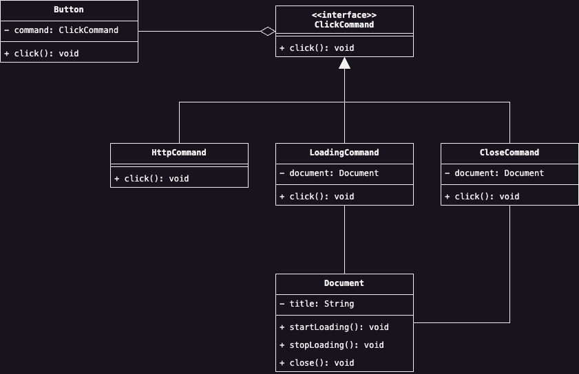

# Command
In un'applicazione che fa uso di intefacce grafiche, vogliamo configurare un componente in modo tale che possa 
eseguire un'azione specifica nel momento in cui si clicchi su di esso con il mouse. L'implementazione classica che 
potremmo usare è quella di creare un metodo ad hoc all'interno del componente che esegua l'azione quando la funzione 
che gestisce il click viene invocata, ad esempio, si potrebbe codificare la soluzione in questa maniera:

```java
public class Button extends Component {
    public void click(MouseEvent event) {
        final var counter = new Counter();
        System.out.println("I'm going to execute my action");
        counter.increment();
    }
}
```

Facendo un passo in avanti, supponiamo adesso di voler inserire la stessa funzione all'interno di un altro Component,
chiamato in questo caso TextView. La soluzione potrebbe essere quella di duplicare il nostro codice all'interno 
dell'altro metodo `click` del Component TextView, tuttavia, questo violerebbe il Principio DRY (Don't Repeat 
Yourself). Quindi, l'ideale sarebbe quella di esportare il contenuto del metodo `click` all'interno di una classe 
che verrebbe usata come dipendenza dai due Component, Button e TextView. Quest'ultimo approccio, tuttavia, sebbene 
sia sufficientemente flessibile, non lo è ancora completamente, in quanto, presuppone che per i due Component se 
dovesse essere inserita un'altra azione diversa da quella descritta nell'esempio, bisognerebbe aggiornare di 
conseguenza le dipendenze e farle puntare verso la nuova classe che la implementa. Allora, l'ultimo passaggio, 
sarebbe quella di astrarre i due metodi che implementano l'azione in modo tale che diventino l'implementazione di 
un'interfaccia comune e che quindi non sia necessario in futuro aggiornare le dipendenze per eseguire il cambio 
dell'implementazione.

Il Design Pattern Command segue questo ragionamento, ossia, incapsula un comando da eseguire su un oggetto invocante 
e spesso esegue delle azioni basandosi sul comportamento esposto da un altro oggetto. L'idea è quella quindi di 
rendere il comando una specie di ponte tra la risorsa che invoca il comando e la risorsa o le risorse usate dal 
comando per implementare l'azione richiesta. Inoltre, per rendere il comando il più flessibile possibile, in modo 
tale che, qualora sia necessario, il comando debba essere cambiato con una sua controparte simile, si ricorre 
all'uso di un'astrazione rappresentata da un'interfaccia o da una classe astratta.

Un'aggiunta rispetto agli altri Design Pattern è che il Comand permette anche di mantenere al suo interno uno 
storico degli stati che sono cambiati all'esecuzione di un'azione, e quindi procedere ad annullarli ripristinando 
lo stato dell'oggetto invocante. Se, in alternativa, un oggetto invocante vuole implementare una serie di comandi 
anzichè uno soltanto, Comand può mantenere al suo interno una catena di riferimenti verso altri Comand che invocherà 
sequenzialmente alla richiesta dell'invocatore.

L'implementazione di questo Design Pattern viene descritta attraverso il seguente Diagramma UML:

<div style="display: flex; justify-content: center; width: 100vw; padding: 1em 2em">
    
</div>

## Partecipanti
Commentando la figura e sulla base dello scenario descritto precedentemente, all'interno del Design Pattern vengono 
inseriti i seguenti partecipanti:

* Il __Command__ è l'astrazione che specifica l'esecuzione di una generica azione, in questo caso la classe 
  `ClickCommand` che possiede il metodo `click`, in quanto il comando specifico che si vuole implementare riguarda 
  l'azione di click da parte dell'utente sul componente.
* I __Concrete Command__ sono le varie implementazioni dei Command, ossia le classi `HttpCommand`, `LoadingCommand` 
  e `CloseCommand`, che descrivono le azioni concrete che il componente deve intraprendere e che eventualmente hanno 
  un riferimento ad un altro oggetto su cui eseguire un'azione.
* L'__Invoker__ è l'entità che invoca effettivamente un Command, la classe `Button` in questo caso, ed al cui 
  interno si inserisce un riferimento all'astrazione Command senza riferirsi direttamente all'implementazione.
* Infine, il __Receiver__ è la classe ricevente l'operazione implementata dal Concrete Command, ossia `Document`.

## Conseguenze
Come descritto precedentemente nllo scenario di partenza, applicare questo Design Pattern ha un impatto immediato 
sulla flessibilità dell'applicazione. Astraendo l'azione dal richiedente, infatti, separa le responsabilità 
rendendole tra loro riusabili tra diversi richiedenti. Inoltre:

1. <u>Permette di comporre comandi multipli</u> ad esempio, implementando un MacroCommand, che contiene una lista di 
   riferimenti ad altri Command da eseguire in maniera seriale.
2. Rende <u>più facile aggiungere nuovi comandi</u>, semplicemente creando nuove implementazioni dell'astrazione 
   Command.