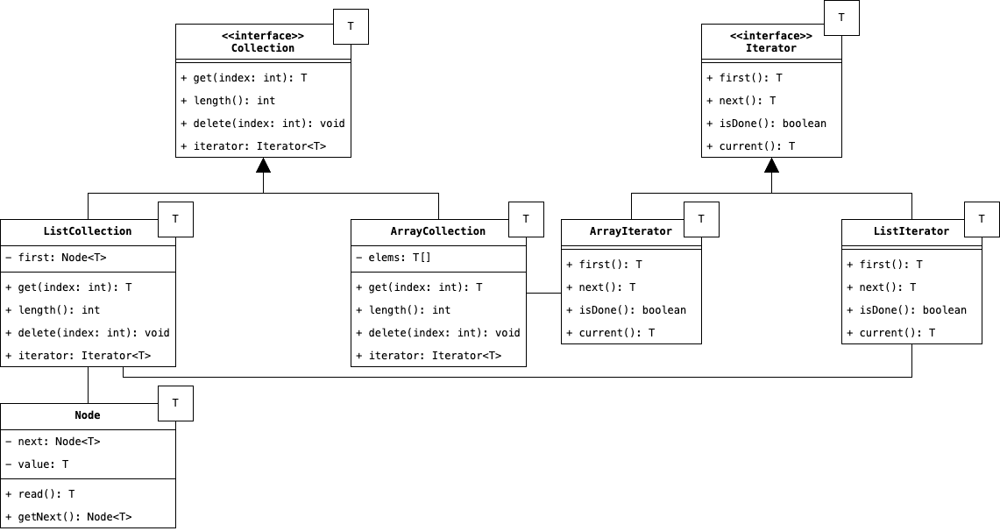

# Iterator
L'attraverso di una struttura dati sequenziale è un'operazione molto comune, che porta spesso alla duplicazione di 
codice, ed alla violazione del principio dell'incapsulamento, esponendo dettagli ed implementazioni interne della 
classe definente la struttura dati. Disaccoppiare la strategia e le modalità con le quali deve essere attraversate 
delle strutture dati, dalle strutture dati stesse, è alla base del Design Pattern Iterator. L'idea è quella di 
definire un'astrazione comune chiamata, appunto, Iterator, al cui interno vengono definiti i metodi con i quali è 
possibile attraversare la collezione. Ciascuna implementazione dell'Iterator definisce una specifica strategia, e 
deve accettare come input un riferimento alla struttura dati da attraversare, se vogliamo evitare l'istanziazione 
diretta dell'iteratore all'interno del codice del client.

Riassumento, il Design Pattern è così organizzato:

    

come possiamo notare, all'interno delle strutture dati, è presente un metodo `iterator` che restituisce un'oggetto 
di tipo `Iterator` e che permette di scorrere indipendentemente le due collezioni, agendo di conseguenza come un 
__Factory Method__ e permettendo al Client di non istanziare direttamente l'iteratore ma lasciare questa 
responsabilità all'oggetto iterato. 

## Partecipanti
Le varie classi che compongono questo Design Pattern sono chiamati come segue:

* L'__Iterator__ è l'astrazione che permette di accedere agli elementi di una collezione e la strategia da 
  implementare per accedervi. Al suo interno devono essere contenuti, infatti, dei metodi che permettono di ottenere 
  l'oggetto corrente dell'attraversamento, verificare se l'attraversamento è completato e passare all'oggetto 
  successivo della collezione. L'Iterator deve anche tenere traccia internamente di quale sia l'oggetto corrente, 
  registrandolo in un attributo della classe.
* I __Concrete Iterator__ sono le varie implementazioni `ArrayIterator` e `ListIterator` che definiscono come poter 
  accedere ai vari elementi dell'oggetto da iterare.
* L'__Aggregate__ `Collection` è l'astrazione che dichiara l'esistanza di un iteratore per la struttura dati da 
  attraversare.
* I __Concrete Aggreagate__ `ListCollection` e `ArrayCollection` sono le implementazioni specifiche della struttura 
  dati e che restituiscono l'iteratore attraverso cui accedere a questi.

## Conseguenze
L'implementazione di questo Design Pattern ha principalmente tre conseguenze sul nostro codice:

1. La più ovvia è sicuramente <u>semplificare l'accesso ad una struttura dati</u>, utilizzando un'astrazione che 
   espone un minimo insieme di metodi come `next`, `current` e `hasNext`.
2. Inoltre, implementare un iteratore come un'oggetto esterno rispetto alla nostra struttura dati, permette di 
   <u>eseguire diverse iterazioni contemporaneamente</u>, quando risulterebbe impossibile eseguire diversi 
   iterazioni sullo stesso oggetto qualora il metodo per iterare fosse implementato direttamente all'interno 
   dell'oggetto stesso.
3. Infine, l'implementazione dell'iteratore richiede molta attenzione per l'<u>accesso concorrenziale ad una 
   struttura dati</u>. Infatti, qualora due iteratori stiano attraversando contemporaneamente una struttura dati, la 
   quale nello stesso istante viene modificata, potrebbe causare riferimenti nulli oppure iterare sulla stessa 
   risorsa due volte a seguito della modifica della struttura dati. Una soluzione semplice potrebbe consistere nel 
   notificare agli iteratori registrati la modifica della struttura dati.

