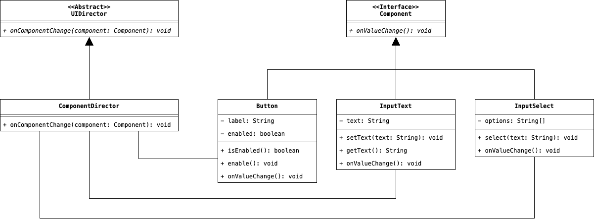

# Mediator
Il Mediator Design Pattern permette di astrarre i meccanismo di orchestrazione di diverse entità software, 
sollevando il Client (ossia l'entità principale che contiene al suo interno tutti questi sotto-componenti) 
dall'onere di gestire questa complessità sempre crescente, separandone le responsabilità e permettendogli di 
concentrarsi solamente su alcuni compiti specifici.

## Scenario d'Uso
All'interno di un'interfaccia grafica sono mostrati diversi componenti, quali: un input testuale, un bottone, un 
menu dropdown selezionabile. L'interazione dell'utente con uno di questi componenti, potrebbe causare il cambiamento 
di un altro di questi, ad esempio: se l'utente scrive una frase che è presente all'interno del menù dropdown, 
automaticamente l'opzione che viene mostrata nel meù viene selezionata e di conseguenza il bottone cambia di stato, 
passando dallo stato di `disabled` a quello di `active`.

In maniera del tutto simile, se l'utente seleziona una delle opzioni presenti all'interno della lista del menù 
dropdown, automaticamente l'input testuale viene avvalorato con il testo selezionato, ed anche in questo caso, il 
bottone passa dallo stato di `disabled` allo stato di `active`.

## Motivazioni
Possiamo immaginare che lo scenario descritto venga implementato direttamente all'interno di un unico componente 
software denominato `UIComponent`. All'interno di questo componente sono presenti rispettivamente: le definizioni 
dei componenti inseriti nell'interfaccia (immaginiamo quindi degli oggetti delle classi `Button`, `InputText` e 
`InputSelect`); e la logica che descrive lo scenario precedente, con tutte le alternative possibili.

L'implementazione dello scenario, dunque, all'interno del componente `UIComponent` comporta però delle 
problematiche. Per prima cosa viene violato il __Principio SOLID__ del __Single Responsibility Principle__, ed 
inoltre, il codice non è sufficientemente flessibile per permettere l'inserimento di una logica alternativa che 
comporti un'aggiornamento diverso dello stato dell'interfaccia grafica. Ad esempio: se volessimo fare in modo che il 
bottone venga attivato solamente nel caso in cui sia l'input testuale che la selezione abbiano lo stesso valore, 
dovremmo ricorrere ad un aggiornamento radicale dell'algoritmo che definisce la logica di aggiornamento 
dell'interfaccia grafica.

L'idea allora è quella di implementare un altro componente chiamato __Mediator__, il cui scopo è quello di 
orchestrare i vari componenti, mantenendo al suo interno un riferimento a questi. Un'esempio di come potrebbe 
funzionare questo nuovo componente potrebbe essere il seguente:

* L'input testuale cambia, ed il cambiamento viene notificato al Mediator.
* Il Mediator estrae l'input testuale inserito.
* Viene passato l'input testuale al dropdown.
* Una volta che viene verificata la corrispondenza tra l'input testuale ed il valore selezionato, il Mediator può 
  eseguire il passaggio di stato del bottone verso quello di `active`.

Inoltre, sarebbe anche ideale che il Mediator esponga un'astrazione, in modo tale che, qualora sia necessario 
cambiare la logica di aggiornamento dell'interfaccia grafica, possa essere sufficiente cambiare l'istanza del 
Mediator inserita all'interno del Client. Così facendo, si sfruttarebbe il polimorfismo per ridurre lo sforzo 
necessario per apportare le modifiche, rendendo di conseguenza il codice molto più flessibile.

## Partecipanti
In termini grafici, il Design Pattern Mediator può essere descritto in questa maniera:

    

per le classi e le interfacce che sono mostrate in questo diagramma, vengono assegnati i seguenti nomi:

* Il __Mediator__ è rappresentato dalla classe `UIDirector`, e definisce l'interfaccia comune attraverso la quale 
  vengono orchestrati i vari componenti dell'interfaccia.
* La classe `ComponentDirector` è il __Concrete Mediator__ al cui interno è implementata la logica di orchestrazione 
  e che conosce e memorizza dei riferimenti ai vari componenti dell'interfaccia grafica.
* I vari componenti `Button`, `InputText` e `InputSelect` sono i __Colleague__, ossia gli elementi dell'interfaccia 
  grafica che comunicano tra loro usando il Mediator.

Come possiamo notare all'interno del diagramma, ciascun component notifica il cambiamento di stato al Mediator, 
usando il metodo `onValueChanged`, ogni volta che è registrato un cambiamento di stato, quindi, il Meditor, usa il 
metodo `onComponentChange` per controllare il cambiamento, ed agire di conseguenza, usando i riferimenti ai vari 
oggetti memorizzati al suo interno. 

## Conseguenze
Mediator possiede i seguenti vantaggi e svantaggi:

1. <u>Disacoppia tra loro gli oggetti</u>, evitando che tra loro i vari componenti abbiano riferimenti, 
   centralizzando invece questi all'interno del Mediator.
2. <u>Semplifica i protocolli di comunicazione</u> sostituendone le interazione con delle relazioni uno a molti tra 
   i colleghi ed i coordinatori.
3. D'altro canto, <u>centralizza il controllo</u> che potrebbe tuttavia, rendere la classe Mediator di fatto troppo 
   complessa da gestire e da manutenere.