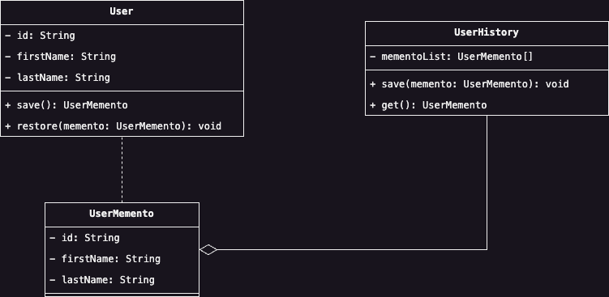

# Memento
Il Memento Design Pattern permette di persistere e ripristinare lo stato interno di un oggetto, astraendone la 
rappresentazione interna, evitando, quindi, di violare il principio dell'incapsulamento esponendo dettagli critici 
riguardo al funzionamento dell'oggetto ad altre classi.

## Scenario d'uso
Immaginiamo che all'interno della nostra applicazione un utente possa modificare il proprio profilo personale. Oltre 
che a memorizzare le informazioni che caratteristicano un profilo, vorremmo fare in modo che l'utente possa 
ripristinare le modifiche precedenemente eseguite. In particolare, il nostro obiettivo è quello di creare una specie 
di storico, in modo tale che le modifiche vengano inserite eseguite vengano registrate all'interno di una collezione,
e che l'operazione di ripristino dello stato precedente, corrisponda al recupero dell'ultimo elemento nella 
collezione qualora ci sia.

Lo scenario gira intorno però ad un problema, ossia: come possiamo registrare le modifiche eseguite ad un oggetto 
senza che vengano registrate all'interno di un altro oggetto del nostro sistema? In altre parole, come possiamo 
esportare le caratteristiche dell'oggetto senza violare il principio dell'incsasulamento?

Il Design Pattern Memento risolve questo problema incapsulando queste informazioni all'interno di un oggetto chiamato 
__Memento__, e che può essere creato solamente dall'oggetto che possiede le informazioni, chiamato __Originator__.
In altre parole, il Memento memorizza le informazioni dell'oggetto da copiare, ma rendendo queste accessibili solamente 
all'oggetto copiato. D'altro canto, dovrà esistenere una classe esterna chiamata __Caretaker__ che si occuperà 
solamente di memorizzare lo storico delle varie classi Memento, che potranno essere usate solamente dalla classe 
originaria del Memento. 

La struttura del pattern, tuttavia, è strettamente legata al linguaggio di programmazione che si sta usando. 
Considerando il linguaggio Java, possiamo implementare il Memento come una classe interna all'oggetto, in altri 
linguaggi sarà necessario usare usare la composizione oppure utilizzare un'interfaccia che fa da ponte tra il 
Memento e il Caretaker. In generale, tuttavia, possiamo identificare il Design Pattern dal seguente diagramma:

    

## Partecipanti
Come è stato descritto nello scenario d'uso, gli attori di questo Design Pattern sono tre:

* Il __Memento__ rappresentanto dalla classe `UserMemento` memorizza lo stato interno di una classe, o meglio, gli 
  elementi necessari a ripristinare lo stato di una classe qualora sia richiesta. Il Memento ha due interfacce: una 
  pubblica da esporre all'oggetto di cui si vuole memorizzare lo stato, ed una privata da esporre al resto 
  dell'applicazione.
* L'oggetto orignale di cui si vuole persistere lo stato è il __Originator__ `User`, e di cui il Memento creerà 
  un'istantanea.
* Infine, il gestore dei Memento di cui però non ne esamina il contenuto è il __Caretaker__ `UserHistory`.

## Conseguenze
L'uso di questo Design Pattern ha diversi vantaggi sull'applicazione:
1. <u>Impedisce la violazione dell'incapsulamento</u> evitando di esporre la struttura interna di una classe anche ad 
   altri oggetti.
2. D'altro canto, <u>comporta un maggiore costo computazionale dipendente dalla struttura dello stato da 
   persistere</u>. L'uso di questo Design Pattern deve essere valutato, infatti, in termine di impatto delle 
   prestazioni che esso comporta.
3. <u>Semplifica l'oggetto da copiare</u>, in quanto sposta la responsabilità della gestione della persistenza nel 
   Caretaker, anzichè inquinare l'oggetto stesso affidandogli la responsabilità di gestire le copie.