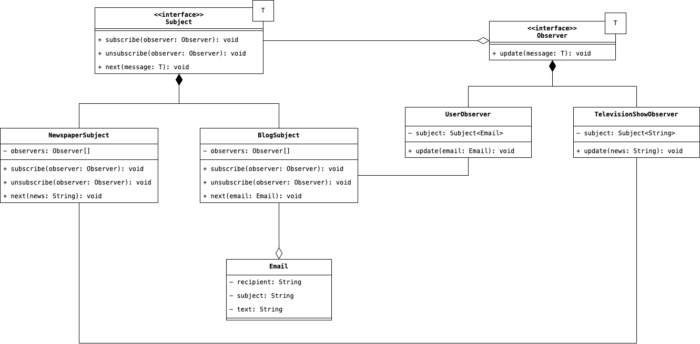

# Observer
Nell'implementazione di sistemi software complessi, spesso si deve scendere a compromessi nel bilanciamento dei 
fattori di consistenza e accoppiamento tra due componenti. Con il termine consistenza definiamo la capacità di un 
componente di inglobare al suo interno un'unica funzionalità senza distribuirla attraverso altri componenti; mentre, 
con il termine accoppiamento definiamo quel legame statico che intercorre tra diversi componenti, rendendoli di 
fatto dipendenti l'uno dall'altro. Un sistema software ben progettato deve minimizzare l'accoppiamento tra i diversi 
componenti. 

Il Design Pattern Observer si occupa quindi di distribuire le varie funzionalità in diversi componenti, ma cercando 
di mantere basso il livello di accoppiamento tra questi. Come vedremo, sebbene siano stati creati diversi componenti,
l'accoppiamento risulta relativamente basso in quanto tra di loro questi componenti non si conoscono. Dunque, il 
mutare di un componente rispetto ad un altro non provoca effetti indesiderati all'interno della struttura stessa.

## Scenario d'uso
Nella vita quotidiana, siamo sempre interessati a rimanere aggiornati sulle varie notizie. Tuttavia, non esiste un 
intervallo di tempo specifico, o una regola assoluta con la quale sappiamo di essere correttamente aggiornati, tutto 
quello che possiamo fare è, invece, rimanere in ascolto di una fonte (rappresentata, ad esempio, da una testata 
giornalistica o da un blog online), ed attendere finché questa fonte non ci comunichi qualcosa. Ovviamente, dunque, 
la fonte deve conoscere chi siano gli utenti che si sono sottoscritti e sono in attesa di notizie, tuttavia, tra 
loro gli utenti non si conoscono, e più nello specifico, non gli interessa conoscere chi siano gli altri utenti che 
come lei siano sottoscritti al servizio di notificazione.

Dunque, da questo primo scenario, possiamo già indentificare due attori fondamentali all'interno del nostro dominio, 
la fonte di notizie, che viene chiamata con il nome specifico di __Subject__ (ossia, il soggetto che distribuisce 
degli aggiornamenti), e l'utente che osserva in silenzio quando qualche nuova notizia viene pubblicata, il quale, 
prenderà il nome di __Observer__.

Adesso, lo scenario, ovviamente, rappresenta in maniera molto sistetica il nostro dominio. Nella realtà, tuttavia, 
non esisterà un unico Subject, ma bensì una gerarchia. In maniera del tutto simile, non esisterà un unico tipo di 
Observer con un'unica logica di reazione agli eventi propagati dal Subject, bensì, ciascun Observer reagirà in 
maniera specifica alle notizie che gli giungono. Perciò, sulla base di queste considerazioni, e sulla base di quanto 
descritto precedentemente, possiamo rappresentare il dominio dello scenario descritto in questa maniera:

    

Analizzando il diagramma UML, possiamo notare come: l'interfaccia Subject non faccia altro che definire un contratto 
che l'Observer deve rispettare nel caso in cui si voglia mettere correttamente all'ascolto di eventuali notizie che 
vengono pubblicate. L'Observer, d'altro canto, ha solamente l'obbligo di rimanere in ascolto, e di procedere alla 
modifica del proprio stato interno, qualora venga ricevuto qualche nuovo messaggio da parte del Subject. Inoltre, 
che sia un `NewspaperSubject` o un `BlogSubject`, il Subject deve mantenere il riferimento a tutti i suoi Observer 
per poter distribuire correttamente a questi le varie notizie. In questo specifico caso, la struttura dati scelta è 
una semplice lista, ovviamente, in presenza di un caso operativo concreto, la lista dovrebbe essere sostituita da 
una struttura dati con migliori performances.

## Partecipanti
Le varie entità che prendono parte all'implementazione di questo Design Pattern, e che abbiamo già visto nella 
figura sovrastante, sono:

* Il __Subject__ rappresentato dall'omonima classe. Come abbiamo già detto, definisce il contratto da stipulare per 
  rimanere correttamente in ascolto di eventuali eventi. Mantiene un archivio di tutti i suoi ascoltatori, al fine 
  di propagare correttamente gli eventi. Definisce attraverso i metodi `subscribe` e `unsubscribe`, le modalità di 
  registrazione ed eliminazione dei vari ascoltatori.
* I __Concrete Subject__ sono di fatto le classi concrete che implementano la logica di notifica dei vari eventi, 
  nel nostro caso sono le due classi `NewspaperSubject` e `BlogSubject`.
* L'__Observer__ è l'interfaccia che definisce il punto di ingresso comune, attraverso il quale un Subject può 
  notificare un nuovo evento.
* I __Concrete Observer__ sono la controparte dei Concrete Subject ma per l'Observer, e sono rappresentati dalle 
  classi `UserObserver` e `TelevisionObserver`. Ciascuno di questi Concrete Observer, quando riceverà una notifica 
  da parte del Subject a cui si è registrato, modificherà il proprio stato interno sulla base di una logica 
  proprietaria.

## Conseguenze
L'applicazione di questo Design Pattern all'interno del nostro progetto, come detto nella parte introduttiva, riduce 
l'accoppiamento tra le varie componenti, mantenendo alta la consistenza. Sebbene, infatti, le responsabilità di 
registrazione e ascolto degli eventi, sono distribuite su diverse classi, ciascuna di queste non si conosce 
reciprocamente. Inoltre:

* Il Pattern stabilisce come sia possibile <u>implementare un sistema di broadcasting</u> degli eventi emessi da un 
  Subject, permettendo l'aggiunta o la rimozione di Observer senza che quest'azione impatti sulle modalità di 
  trasmissione degli eventi.
* D'altro canto, ciascun <u>Subject non è a conoscenza dell'effettivo costo che ha un evento su un Observer</u>, 
  potrebbero allora essere propagati eventi che richiedono un costo computazione non indifferente per un Observer.