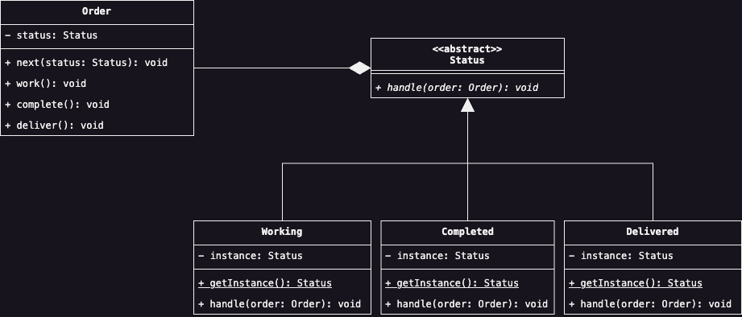

# State
Il Design Pattern __State__ permette di cambiare dinamicamente il comportamento di un oggetto, al variare dello 
stato interno dello stesso. La variazione del comportamento e dello stato si basa sull'incapsulamento dell'ultimo 
all'interno di una classe, la cui gerarchia rappresenterà l'insieme ammissibili di stati interni dell'oggetto stesso.

## Scenario d'uso
Nella nostra applicazione per gestire una serie di ordini, ciascun ordine può assumere quattro diversi stati, 
rispettivamente: In Elaborazione; In Lavorazione; Completato; ed infine Consegnato. Nel momento in cui l'ordine è 
pronto per passare da uno stato ad un altro, viene notificato ad un sistema centralizzato il passaggio imminente 
dello stato, con una successiva notifica al cliente finale dell'avanzamento di stato del proprio ordine. Una volta 
che la notifica è stata inviata correttamente al cliente, l'ordine può passare allo stato successivo. 

Basandoci su questa semplice descrizione, potremmo implementare all'interno dell'ipotetica classe `Order.java`, una 
serie di metodi chiamati rispettivamente `work`, `complete` e `deliver` che cambino lo stato dell'ordine 
rispettivamente in 'In Lavorazione', 'Completato' e 'Consegnato':

```java
public final class Order {
    private final User user;
    private OrderStatus status;

    public Order(User user) {
        this.user = user;
        this.status = OrderStatus.ELABORATING;
    }
    
    public OrderStatus getCurrentStatus() {
        return this.status;
    }
    
    public void setCurrentStatus(OrderStatus status) {
        this.status = status;
    }
    
    public User getUser() {
        return this.user;
    }
    
    public void work() {
        final var orderUser = this.getUser();
        final var currentStatus = this.getCurrentStatus();
        final var notificationService = NotificationService.getInstance();
        
        notificationService.send(orderUser, "Your order is working");
        this.setSatatus(OrderStatus.WORKING);        
    }
    
    public void complete() {
        final var orderUser = this.getUser();
        final var currentStatus = this.getCurrentStatus();
        final var notificationService = NotificationService.getInstance();

        notificationService.send(orderUser, "Your order has been completed");
        this.setSatatus(OrderStatus.WORKING);
    }

    public void deliver() {
        final var orderUser = this.getUser();
        final var currentStatus = this.getCurrentStatus();
        final var notificationService = NotificationService.getInstance();

        notificationService.send(orderUser, "Your order has been delivered");
        this.setSatatus(OrderStatus.WORKING);
    }
}
```

Analizzando il codice mostrato, quale potrebbe essere un problema di questo? Sicuramente su una scala così piccola 
un codice simile non ha difetti se testato a dovere, possiamo anche dire che sia un codice pulito. Pensando però su 
larga scala, in un ambiente in cui la transizione da uno stato ad un altro richieda molta più che una semplice 
elaborazione di una notifica da inviare all'utente, ed in cui il numero di stati è maggiore dei quattro che sono 
stati scelti, la corretta organizzazione del codice ha un impatto significativo sull'interno progetto.

Concentrando però la nostra attenzione sul codice, noteremo che il perno sul quale ruota tutta la logica di 
elaborazione è il concetto di stato stesso di un ordine. Rielaborando il codice pensando allo stato dell'ordine non 
come un semplice enumerativo ma come un oggetto proprio, potremmo definire all'interno dell'oggetto stato, la 
logica con cui viene eseguita una transizione da uno stato al suo successivo e che è attualmente codicata 
all'interno di ciascun metodo della classe `Order`. 

Incapsulando lo stato in un oggetto che componente l'ordine stesso, siamo in grado di separare la logica con la 
quale viene calcolato lo stato successivo e definita la transizione, dalla logica intrinseca riservata 
all'elaborazione di un ordine. Così facendo, siamo in grado di rispettare il Single Responsibiliy Principle.

Sulla base di queste considerazioni, potremmo riorganizzare il codice in questa maniera:

<div style="display: flex; justify-content: center; width: 100vw; padding: 1em 2em">
    
</div>

Come possiamo notare dal diagramma, abbiamo combinato il Pattern Singleton in modo tale che esista una sola istanza 
di uno stato di un ordine. Concettualmente, l'esistenza di un solo tipo per stato è corretto, inoltre, siccome il 
processo di elaborazione non dipende dallo stato intrinseco dell'oggetto di tipo `Status`, ha ulteriormente senso 
che non siano necessarie istanze successive di questi oggetti.

## Partecipanti
All'interno di questo pattern possiamo identificare le seguenti entità:
* Il __Context__ viene rappresentato dalla classe `Order`. Di fatto, il Context rappresenta l'effettivo contesto da 
  cui vogliamo estrarre lo stato interno, in modo tale da astrarne la logica di elaborazione, basata sul primo.
* Lo __State__ rappresentato da `Status` è l'astrazione che definisce il contratto con il quale si deve implementare 
  la logica di elaborazione dello stato.
* Il __Concrete State__, infine, rappresentato dalle classi `Working`, `Completed` e `Delivered` rappresentano gli 
  stati effettivi estrapolati dal Context, con l'effettiva logica di lavorazione.

## Conseguenze
Per concludere, l'applicazione di questo Design Pattern ha, in ordine, le seguenti conseguenze sul nostro codice:
1. <u>Localizza il comportamento relativo ad un stato</u> all'interno di una classe, separando la logica con cui si 
   deve gestire la transizione dal contesto in cui questa verrà eseguita. Inoltre, l'aggiunta di un nuovo stato per 
   un Context richiederà solamente la creazione di una nuova classe. 
2. <u>Rende risuabile uno stato</u>, infatti, diversi Context possono condividere la stessa istanza di uno stato 
   interno ove questo sia permesso.
3. Di contro, tuttavia, <u>aumenta il numero complessivo di classi</u>, nel caso in cui gli stati di un oggetto 
   siano un numero relativamente grande.
4. <u>Rende le transizioni atomiche</u>, in quanto la modifica dello stato di un oggetto avverrà semplicemente 
   sostituendo il riferimento alla relativa istanza, evitando quindi di modificare attributi interni al Context.