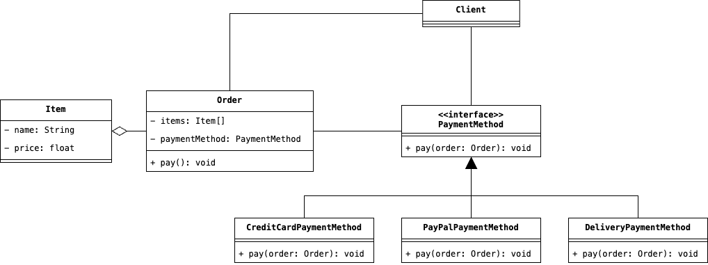

# Strategy
Incapsulare una famiglia di algoritmo all'interno di classi separate, in modo tale da poter rendere queste classi 
riusabili ed sostituibili durante l'esecuzione, è l'obiettivo del Design Pattern Strategy

# Scenario d'uso
Nella nostra applicazione web abbiamo implementato diversi metodi di pagamento che varianto dal semplice pagamento 
tramite carta di credito, al pagamento alla consegna dell'ordine. Ipoteticamente, all'interno della classe che 
rappresentarebbe un ordine, dovremmo avere un metodo chiamato `pay` che permetta di completare il pagamento 
dell'ordine sulla base del metodo scelto. Supponiamo, quindi, che la nostra classe `Order` sia organizzata in questa 
maniera:

```java
public class Order {
    private final BufferedReader reader;
    private final List<Item> items;
    private String paymentMethod;
    private final PayPalService payPalService;
    private final CreditCardPaymentService creditCardService;
    
    public Order() {
        this.payPalService = new PayPalService();
        this.paymentMethod = PaymentMethod.CREDIT_CARD;
        this.creditCardService = new CreditCardPaymentService();
        this.reader = new BufferedReader(new InputStreamReader(System.in));
    }
    
    public void setPaymentMethod(PaymentMethod paymentMethod) {
        this.paymentMethod = paymentMethod;
    }
    
    public PaymentMethod getPaymentMethod() {
        return this.paymentMethod;
    }
    
    public void pay() {
        if (this.paymentMethod == PaymentMethod.CREDID_CARD) {
            final var cardNumber = this.reader.readLine();
            final var pin = this.reader.readLine();
            
            this.creditCardService.pay(cardNumber, pin);
            
            return;
        }
        
        if (this.paymentMethod == PaymentMethod.PAYPAL) {
            final var email = this.reader.readLine();
            final var password = this.reader.readLine();
            
            this.payPalService.checkConnection();
            
            this.payPalService.pay(email, password);
            
            return;
        }
        
        final var address = this.reader.readLine();
        System.out.println("The order will be payed on delivery");
    }
}
```

Che problema c'è con questo codice? Prima di tutto possiamo dire che all'interno della classe `Order` sono inseriti 
dettagli per l'uso di servizi esterni, in questo caso `CreditCardService` e `PayPalService`. Inoltre, la 
registrazione di un nuovo metodo di pagamento, richiede necessariamente l'estensione del metodo `pay` con l'aggiunta 
di un nuovo ramo condizionale. 

In questo esempio specifico, l'inserimento di un nuovo ramo condizionale non rappresenta un'effettiva minaccia alla 
manutenibilità nel nostro codice, in fin dei conti, i metodi di pagamenti ammissibili diventerebbero solamente 
quattro in totale. Tuttavia, in un'effettiva realtà operativa, che richiederebbe l'uso di diversi metodi di 
pagamento, oltre ad eventuali varianti di metodi già registrati (supponiamo, ad esempio, che occorra dividere i 
pagamenti con carte di credito sulla base dei circuiti Visa o PagoBancomat), si verificherebbe un'esplonsione di 
complessità all'interno del metodo `pay`.

La soluzione è quindi applicare il Design Pattern Strategy, ossia, incapsulare i diversi algoritmi di pagamento con 
i loro dettagli, all'interno di classi specifiche e mantenendo il riferimento della classe `Order` ad un generico 
metodo di pagamento chiamato `PaymentMethod`, rappresentato da un'interfaccia o una classe astratta. L'idea quindi, 
porterebbe ad un'organizzazione simile a quella corrente:

<div style="display: flex; justify-content: center; width: 100vw; padding: 1em 2em">
    
</div>

Commentando la figura sopra, possiamo dire che:
1. Per prima cosa notiamo come le varie "strategie", ovvero gli algoritmi che implementato effettivamente 
   un'operazione di pagamento, sulla base della tipologia stessa di questo, sono stati incapsulati all'interno di 
   classi la cui astrazione è un generico metodo di pagamento.
2. Il riferimento tra un ordine ed il rispettivo metodo di pagamento avviene attraverso l'uso di una relazione tra 
   la classe `Order` e l'astrazione `PaymentMethod`. Questo tipo di accoppiamento debole ci permette di specificare 
   anche a tempo di esecuzione, quale sia l'effettiva implementazione che vogliamo utilizzare all'interno del metodo 
   `pay`.
3. Non esiste un insieme ben definito di parametri da dover passare all'effettivo algoritmo di pagamento 
   implementato all'interno dei vari metodi `pay` delle varie implementazioni di `PaymentMethod`. Per questo motivo, 
   onde evitare l'uso di parametri non utilizzate, ed un eventuale spreco di risorse, si è preferito passare 
   l'interno oggetto di tipo `Order`, a ciascun metodo `pay` delle implementazioni. 

## Partecipanti
Come possiamo vedere dal diagramma precedente, all'interno del Design Pattern Strategy, agiscono i seguenti attori:
* Il __Context__ è l'entità al cui interno si vogliono usare diverse strategie di implementazione di un algoritmo, 
  nel nostro caso, il Context è rappresentato dalla classe `Order`. 
* L'entità __Strategy__, d'altro canto, rappresenta, invece, il punto di accesso comune alle varie strategie che si 
  vorranno implementare. L'interfaccia `PaymentMethod` definisce, infatti, il contratto comune con le varie 
  strategie, attraverso la definizione del metodo `pay`.
* Infine, le diverse implementazioni di una Strategy, sono le cosidette __Concrete Strategy__, ossia: le diverse 
  strategie effettive che si dovranno usare all'interno del sistema, nel nostro caso: `CreditCardPaymentMethod`, 
  `PayPalPaymentMethod` e `DeliveryPaymentMethod`.

## Conseguenze
L'applicazione del Design Pattern Strategy ha complessivamente le seguenti conseguenze sulla nostra applicazione:
* <u>Eliminazione dei blocchi condizionali</u>. Incapsulando i comportamenti in classi separate si elimina la 
  necessità di gestire diversi blocchi condizionali.
* <u>Creazione di una gerarchia di algoritmi</u> tra loro correlati, con un conseguente aumento della riusabilità su 
  classi di algoritmi utilizzati in altre parti dell'applicazione.
* Evita l'uso dell <u>ereditarietà sulla classe Context</u>, separando quindi l'algoritmo dal suo contenitore.
* Per contro, si verifica un <u>aumento complessivo del numero di oggetti nell'applicazione</u>.