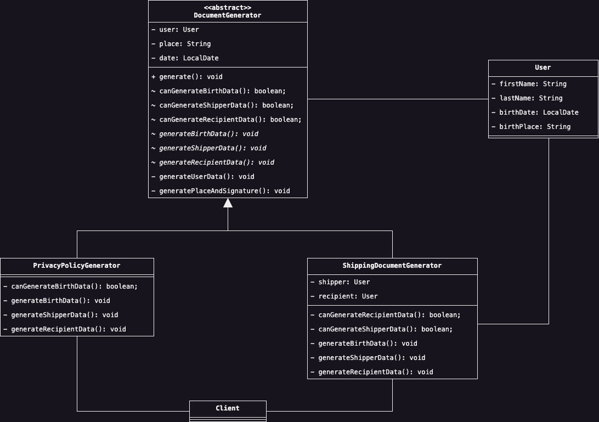

# Template Method
Il Template Method Design Pattern divide la struttura di un algoritmo in singoli micro passi, ed incapsula 
successivamente questi passi all'interno di specifici metodi di una classe astratta, le cui specifiche 
implementazioni decideranno quali passi o no modificare o mantenere rispetto alla versione originale.

## Scenario d'Uso
In un'applicazione per generare dinamicamente diversi documenti abbiamo diverse classi che implementano un algoritmo 
generativo, similmente a quanto può essere visto nei seguenti esempi:

```java
import java.time.LocalDate;

public class PrivacyPolicyGenerator {
    public void generate() {
        final var firstName = this.user.getFirstName();
        final var lastName = this.user.getLastName();

        // Do stuff ...

        final var birthPlace = this.user.getBirthPlace();
        final var birthDate = this.user.getBirthDate();

        // Do stuff ...

        final var dataOwner = this.dataOwner.getName();

        // Do stuff ...

        final var place = 'Here';
        final var date = LocalDate.now();

        // Do stuff ...
    }
}
```

```java
public class ShippingDocumentGenerator {
    public void generateDocument() {
        final var firstName = this.user.getFirstName();
        final var lastName = this.user.getLastName();

        // Do stuff ...
        
        final var shipperFirstName = this.shipper.getFirstName();
        final var shipperLastName = this.shipper.getLastName();

        // Do stuff ...

        final var recipientFirstName = this.recipient.getFirstName();
        final var recipientLastName = this.recipient.getLastName();

        // Do stuff ...

        final var place = 'Here';
        final var date = LocalDate.now();

        // Do stuff ...
    }
}
```
Con un primo sguardo possiamo da subito notare che i due algoritmi `generate` e `generateDocument` abbiano in comune 
alcuni step. Supponendo che si voglia aggiungere una nuova versione di questo algoritmo, sarà necessario 
implementare una terza classe al cui interno quasi sicuramente sarà presente del codice duplicato, e proveniente 
dagli altri due algoritmi. L'idea è quindi quella di estrapolare le parti in comune tra questi algoritmo, inserirli 
all'interno di una super-classe astratta e definire le parti variabili dell'algoritmo all'interno di ogni specifica 
sotto-classe.

In termini grafici, quello che vogliamo ottenere è molto simile a questo diagramma:

<div style="display: flex; justify-content: center; width: 100vw; padding: 1em 2em">
    
</div>

Come possiamo notare, il Design Pattern è relativamente semplice, e consiste nell'implementare una macro classe 
astratta (nel nostro caso la classe `DocumentGenerator`), dalla quale le varie sotto classi implementeranno i metodi 
che gli interessano. All'interno della super classe astratta è presente un unico metodo pubblico, ossia il metodo 
`generate`, al cui interno sono implementate le varie fasi dell'algoritmo. Inoltre, siccome non tutti i metodi 
astratti che vengono ereditati da una sotto classe conterranno l'effettiva implementazione, possiamo permettere che 
il metodo `generate` ignori un passo a seconda del valore booleano restituito da un metodo __hook__ come 
`canGenerateBirthData` o `canGenerateShipperData`.

## Partecipanti
Come accennato precedentemente, il Design Pattern è relativamente semplice e vede coinvolti solamente due attori:
* L'__Abstract Class__ è la super-classe che definisce la struttura dell'algoritmo da implementare, nel nostro caso 
  la classe `DocumentGenerator`.
* Le varie __Concrete Class__ implementaranno invece i metodi di loro interesse, a seconda delle specifiche esigenze,
  come nelle classi `PrivacyPolicyGenerator` e `ShippingDocumentGenerator`.

## Conseguenze
L'implementazione di questo Design Pattern all'interno del nostro codice ha i seguenti benefici e contro-indicazioni:
1. <u>Aumenta il livello di riusabilità del codice</u>, permettendo di implementare più facilmente diverse varianti 
   di un algoritmo che adesso può generare in maniera dinamica.
2. Può causare un'<u>esplosione del livello di complessità della classe astratta</u>, qualora l'algoritmo 
   implementato consista di numerosi passaggi.


