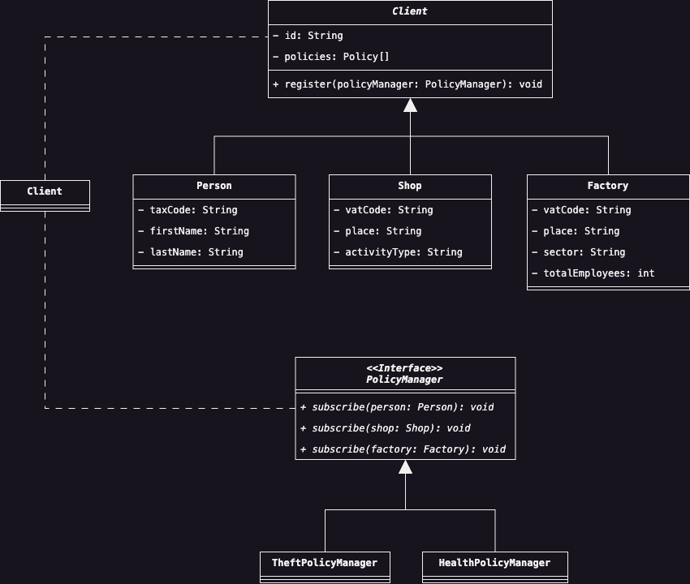

# Visitor

Una delle conseguenze fondamentali del Design Pattern Visitor, è la separazione tra una classe e le relative
funzionalità che questa dovrà implementare. Seguendo questo criterio di separazione, tramite Visitor è possibile
definire nuove operazioni per una classe senza modificarne la struttura esistente.

## Scenario d'uso

Immaginiamo di lavorare ad un'applicazione per un'azienda di assicurazioni che dispone di diverse polizze per i
propri clienti. Idealmente, identifichiamo tre tipi di polizze assicurative: polizza Furto e Incendio; polizza
Medica; polizza per Disastri Ambientali. Ciascuna di queste polizze può essere sottoscritta da diversi clienti del
nostro sistema, inoltre, deve anche essere permesso combinare tra di loro per polizze su richiesta del cliente.

La soluzione più immediata per poter associare una polizza ad un'entità del nostro sistema, sarebbe quella di
inserire un metodo per associare e dissociare la polizza, direttamente all'interno della classe che rappresenta la
nostra entità, ad esempio: supponiamo che una di queste entità sia la classe `Client` (che rappresenta un generico
cliente), possiamo implementare il seguente metodo all'interno della classe:

```java
public class Client {
    private String firstName;
    private String lastName;
    private String taxCode;

    private final List<Policy> subscribedTo;

    public Client(String firstName, String lastName, String taxCode) {
        this.taxCode = taxCode;
        this.lastName = lastName;
        this.firstName = firstName;
        this.subscribedTo = new ArrayList<>();
    }

    public void subscribe(Policy newPolicy) {
        this.subscribedTo.add(newPolicy);
    }

    public void unsubscribe(Policy policy) {
        if (!this.subscribedTo.contains(policy)) {
            throw new IllegalArgumentException("Unknown policy!");
        }
        this.subscribedTo.remove(policy);
    }
}
```

Esaminando il codice che abbiamo appena descritto, questo implicherebbe che ciascuno di questi nuovi metodi
dovrebbe essere implementato all'interno di ciascuna classe della nostra gerarchia, sebbene in questo caso i due 
metodi `subscribe` e `unsubscribe` sono relativamente semplice, ed associano solamente un nuovo oggetto di tipo 
`Policy` all'entità corrente. Tuttavia, nel caso in cui il processo di associazione e dissociazione
richieda una sequenza di operazioni molto complicate, al fine di non inquinare il codice corrente, sarebbe opportuno
separare le responsabilità tra il processo di associazione/dissociazione, dalla classe model che definisce la nostra
entità di interesse.

Basandosi su queste semplici considerazioni, quindi, vogliamo estrarre questi metodi dalla classe corrente,
inserirli all'interno di una nuova classe, ed usare un unico punto di accesso all'interno della classe, che permetta 
di invocare il metodo che ci interessa. La discussione adesso si sposta su come poter selezionare il metodo corretto 
all'interno di questa nuova classe, basandosi sulla classe di partenza che invoca il metodo richiesto. Una valida 
alternativa sarebbe quella di implementare una serie di controlli e verificare quale sia il modello invocante il 
metodo, tuttavia, una soluzione più elegante consiste nell'usare l'__overload__ del metodo definendone diverse 
versioni sulla base delle possibili entità che lo invocano.

Traendo le somme, possiamo raggruppare le considerazioni precedenti all'interno del seguente diagramma:

<div style="display: flex; justify-content: center; width: 100vw; padding: 1em 2em">
    
</div>

## Partecipanti
Come possiamo notare dal diagramma, sono coinvolti i seguenti attori:
* La classe `PolicyManager` che rappresenta il __Visitor__, ossia l'oggetto "visitante" della nostra gerarichia, e 
  la cui visita permetterà ad una di queste classi concrete di invocare il metodo di interesse.
* Il __Concrete Element__, rappresentato dalle classi `TheftPolicyManager` e `HealthPolicyManager` implementa una 
  versione dell'algoritmo che vogliamo invocare sulla classe.
* L'__Element__, ossia la classe classe `Client`, definisce solamente un punto di ingresso (ossia il metodo 
  `register`), attraverso il quale un Visitor può essere invocato ed in cui sarà implementato il corrispondente 
  metodo da richiedere.
* Infine, il __Concrete Element__ è rappresentato dalle classi `Person`, `Shop` e `Factory`, contiene la rispettiva 
  implementazione del metodo `register`, passando a questo come parametro il riferimento all'oggetto corrente per 
  invocare il metodo corretto.

## Conseguenze
L'applicazione del Design Pattern ha le seguenti conseguenze il nostro codice:
1. </u>Riduzione della complessità nell'aggiunta di nuove operazioni.</u> In questo modo, per aggiungere nuove 
   operazioni ad una classe esistente, senza che si voglia "inquinare" il codice già presente, aggiungendone 
   responsabilità extra o magari non direttamente collegate alla classe corrente, sarà necessario creare un Visitor 
   correlato alla classe d'interesse.
2. <u>Unificazione delle operazioni correlate, e separazione di quelle scorrelate.</u> Le funzionalità che sono 
   collegate ad una specifica responsabilità, possono essere concentrate all'interno di un Visitor senza che vengano 
   distribuite su diverse classi.
3. <u>Aumento della complessità nell'aggiunta di una nuova classe all'interno della gerarchia esistente.</u> Se 
   volessimo implementare una nuova classe concreta di Element, questa dovrà necessariamente implementare il metodo 
   `visit`. Nell'applicazione del Design Pattern, quindi, dobbiamo chiederci se le operazioni da implementare su una 
   classe varino più frequentemente rispetto alla struttura stessa di questa, in tal caso, applicare il Design 
   Pattern giustificherebbe lo sforzo implementativo nel ridefinire un'implementazione del metodo.
4. <u>Rottura dell'incapsulamento.</u> Per permettere a Visitor di lavorare correttamente, questo deve accedere a 
   dettagli della classe Concrete Element, che probabilmente non sarebbero normalmente esposti al Visitor. Bisogna 
   quindi valutare se valga la pena esporsi descrivendo nuovi dettagli della classe.
