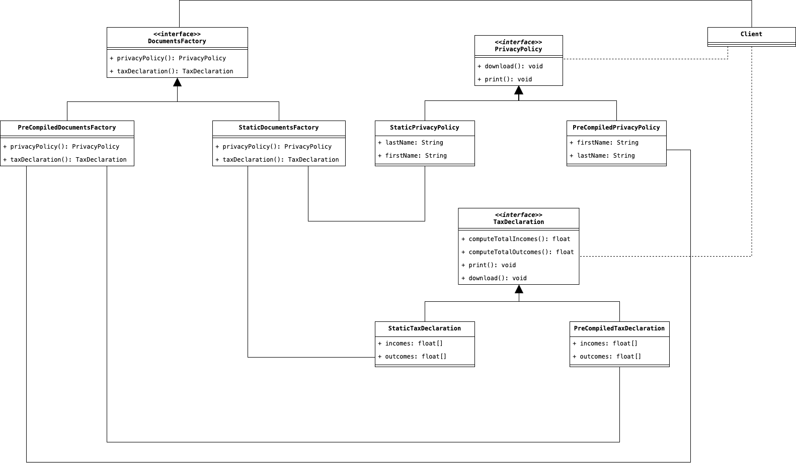

# Abstract Factory
Lo scopo di questo Design Pattern è quello di fornire una strategia di creazione di oggetti appartenenti a diverse 
gerarchie, astraendo il processo di istanziazione e delegandolo ad una classe factory.

## Scenario d'uso
Consideriamo il seguente scenario: un'applicazione web è in grado di generare una serie di Documenti Precompilati 
che possono essere modificati successivamente dal Cliente, oppure generare direttamente il Documento Statico senza 
che sia possibile modificarlo in futuro. Esistono diverse tipologie di Documenti che possono essere precompilati o 
generati direttamente in maniera statica, però ci limiteremo a considerarne due: il primo tipo di documenti sarà il 
Trattamento dei Dati Personali; invece, il secondo sarà la propria Dichiarazione dei Redditi.

Considerando solamente questo semplice scenario, se avessimo implementato un algoritmo che gestisce al suo interno 
direttamente istanze di Trattamenti dei Dati Personali o Dichiarazioni dei Redditi generate dinamicamente, sarebbe 
stato molto difficile trasformare successivamente queste instanze nella loro controparte generata staticamente. 

Tuttavia, la chiave per organizzare meglio la rappresentazione delle nostre classi, risiede proprio nella 
categorizzazione con cui i vari documenti sono stati descritti. Considerando quindi che ciascun documento può essere 
di due tipologie, rispettivamente: __Trattamenti dei Dati Personali__ e __Dichiarazione dei Redditi__, possiamo 
costruire attorno a questa categorizzazione, una classe che restituisca un'istanza specifica di questi documenti, 
che sia stata precompilata o statica. Questa particolare tipo di classe che restituisce un'istanza (evitando al 
Client di istanziare esplicitamente una classe) viene denominata __Factory Class__.

E'facile intuire che nel nostro esempio, avremo rispettivamente due __Factory Class__, rispettivamente: la prima per 
generare documenti precompilati; mentre la prima per generare gli stessi documenti ma statici. Dichiarando queste 
classi come implementazione di una generica interfaccia astratta denominata __Abstract Factory__, in futuro potremo 
usare il Polimorfismo per usare una particolare istanza di una __Factory Class__ al posto di un'altra, evitando 
problemi di dipendenza nel codice.

In termini grafici, l'organizzazione del nostro codice seguirà questo diagramma:

## Partecipanti
All'interno del diagramma, possiamo identificare i seguenti attori:

* La classe `DocumentFactory` è anche denominata __AbstractFactory__ in quanto è l'interfaccia attraverso la quale 
  possiamo definire le varie Classi Factory della nostra applicazione, con cui successivamente, sfruttando il 
  polimorfismo, possiamo usare al posto di una o di un'altra classe.
* Le classi `StaticDocumentsFactory` e `PreCompiledDocumentsFactory` sono le __Concrete Factory__ che si occupano 
  di creare i nostri oggetti finali, appartenenti alla categoria che queste definiscono. Nel primo caso saranno le 
  i Documenti Precompilati, mentre nel secondo i Documenti Statici.
* Gli __Abstract Product__ `TaxDeclaration` e `Privacy Policy` definiscono la categoria generale di 
  appartenenza delle varie sotto classi __Concrete Product__ come `PreCompiledTaxDeclaration` e `StaticTaxDeclaration`.
* Infine, il __Client__ è il richiedente del Pattern, che lavorerà solamente utilizzando le varie interfaccie 
  definite nell'applicazione.

## Conseguenze
L'utilizzo di questo Design Pattern, ha le seguenti conseguenze nel nostro codice:

1. <u>Isola le classi concrete</u>, esponendo solamente le interfacce, e nascondendo le varie implementazioni senza 
   che il Client possa sapere quale sia l'effettiva classe concreta che sta utilizzando.
2. <u>Facilita lo scambio delle implementazioni</u>, minimizzano i cambiamenti che vengono eseguiti nel codice del 
   Client, in quanto il Client utilizzerà solamente le classi astratte che vengono istanziate delle varie Factories.
3. Rende <u>coerente il codice</u> permettendo solamente di utilizzare una categoria di classi concrete per volta.
4. Come aspetto negativo, tuttavia, è da sottolineare che con questo pattern <u>risulta più difficile aggiungere una 
   nuova categoria di classe astratta oppure una classe concreta appartenente ad una categoria già esistente</u>. In 
   quanto, le modifiche devono essere eseguite su diverse parti del codice.