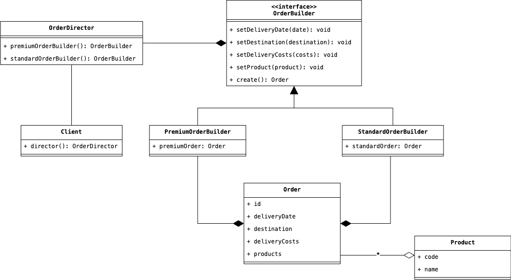

# Builder
Il Design Pattern Builder astre il processo di costruzione di un oggetto, permettendo di comporre in maniera 
dinamica ed incrementale il suo stato interno.

# Scenario d'uso
Concentriamoci su questo scenario, tratto da un'applicazione gestionale per un'azienda di trasporti. Abbiamo creato 
un'applicazione che permette di gestire diversi ordini contenenti un numero arbitrario di prodotti, e che devono 
essere consegnati entro una data prefissata al cliente. Sulla base del piano di abbonamento del cliente, vengono 
creati diversi tipi di ordini. Ad esempio: un cliente potrebbe aver sottoscritto un abbonamento standard senza 
pagare alcuna tassa aggiuntiva, e che permette la consegna dell'ordine solamente presso un centro autorizzato, entro 
una data massima di tre settimane. Analogamente, un cliente potrebbe aver sottoscritto un abbonamento premium che 
gli permetta di ricevere direttamente l'ordine in un luogo specifico, senza pagare spese di spedizione e ricevendolo 
entro massimo 1 settimana.

Come possiamo rappresentare brevemente il processo di creazione di un ordine all'interno della nostra applicazione? 
Possiamo immaginare uno scenario di questo tipo, in cui è definito un metodo `createOrder` che riceve una serie di 
parametri e che restituisce l'Ordine appena creato:

```java
public class OrderManager {
    public Order createOrder(String deliveryDate, List<Product> products, Subscription subscription) {
        if (subscription == Subscription.STANDARD) {
            return new StadardOrder(deliveryDate, products, subscription);
        }
        return new PremiumOrder(deliveryDate, products, subscription);
    }
}
```

Per non perdere tempo, il nostro esempio è molto semplificato. Ovviamente, il numero di parametri in uno 
scenario concreto è molto più complesso, e causerebbe un aumento della complessità nella gestione del codice, in 
quanto la lista dei parametri che viene passata al costrutture sarebbe troppo lunga. Infine, sarebbe necessario 
eseguire l'overload del costruttore diverse volte, sulla base delle diverse combinazioni di parametri che vogliamo 
usare per creare l'ordine. 

Oltre a quanto descritto precedentemente, un altro problema è rappresentato dalla violazione del principio 
dell'incapsulamento, in quanto siamo esponendo al client dei dettagli su come dovrà essere creato l'Ordine, e nel 
caso in cui si aggiungano in futuro degli altri piani di abbonamento, sarà necessario modificare il codice, 
aggiungendo altri rami condizionali a quelli già presenti.

Avendo bene in mente la nostra problematica, il Design Pattern __Builder__, risolve quando descritto prima, astraendo 
il processo di creazione di un ordine e definendone le varie logiche di creazione all'interno di diverse 
classi denominate __Concrete Builder__. Affinchè queste classi siano tra loro interscambiabili (e quindi sia 
possibile utilizzare una logica di creazione diversa senza dover modificare il codice del Client), sfruttando il 
Polimorfismo, verrà creata una classe astratta o un'interfaccia che prende il nome di __Builder__ e che definisce lo 
scheletro del processo di creazione di un ordine a cui tutte le classi Concrete Builder dovranno attenersi. Un 
ulteriore passo aggiuntivo, che astrae il processo di creazione, è rappresentato dalla classe __Director__, ossia la
classe che si occupa di restituire i vari Concrete Builder sulla base della richiesta del Client, sulla base della 
richiesta del Client.

Per chiarire meglio le idee, vediamo come viene rappresentato questo Design Pattern in un Diagramma UML:



## Partecipanti
Come possiamo vedere, nel nostro diagramma agiscono rispettivamente le seguenti entità:

* Il Director rappresentato dalla classe `OrderDirector`, restituisce un Builder sulla base della richiesta del Client.
* Il Builder rappresentato dalla classe `OrderBuilder`, definisce la struttura comune del processo di creazione di 
  un Ordine, che tutti i Concrete Builder `PremiumOrderBuilder` e `StandardOrderBuilder` dovranno implementare.
* Infine, ciascun Concrete Builder, conterrà al suo interno un riferimento all'Ordine appena creato e che rispecchia 
  le caratteristiche richieste dal Client.

## Conseguenze

Applicato all'interno del nostro codice, il Design Pattern ha le seguenti conseguenze:

1. <u>Astrae il processo di creazione e la rappresentazione del prodotto finale</u>. Il processo di creazione di un 
   Concrete Product adesso può seguire un flusso diverso sulla base delle esigenze del Client, permettendo di 
   eseguire alcuni passi di creazione dell'oggetto finale rispetto ad altri.
2. <u>Favorisce la modularità</u>, permettendo di implementare in un secondo momento diverse logiche di creazione di 
   un Prodotto Finale, incapsulandone i processi di creazione in classi concrete.
3. <u>Consente un migliore controllo del processo di costruzione</u>. E'possibile infatti ottenere un'istanza del 
   nostro Prodotto Concreto finale se e soltanto se il processo di creazione è stato esplicitamente creato. Inoltre, 
   non esiste più uno schema rigido da seguire nel processo di creazione dell'Prodotto Finale.
