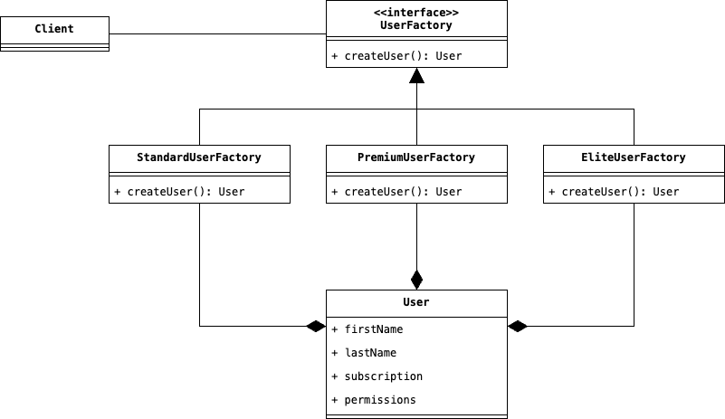

# Factory

Comunemente anche chiamato __Factory Method__, la sua applicazione ruota attorno all'implementazione di un metodo 
che è in grado di restituire una specifica entità finale al Client sulla base della logica richiesta da quest'ultimo.
Cosideriamo il seguente scenario: un'applicazione web è in grado di registrare diversi tipi di Utenti, a cui viene 
aventi un insieme specifico di privilegi, dettati dal tipo di Contratto che hanno sottoscritto. Immaginando che le 
operazioni che possono eseguire gli utenti si limitano ad un insieme CRUD applicabile su dei Post, un funzionamento 
dell'applicazione potrebbe essere qualcosa di simile a questo codice.

```java
public class Application {
    public void createUser (UserSubscriptionType suscriptionType) {
        final User user;
        if (subscriptionType == UserSubscriptionType.STANDARD) {
            user = new StandardUser();
        }
        if (subscriptionType == UserSubscriptionType.PREMIUM) {
            user = new PremiumUser();
        }
        if (subscriptionType == UserSubscriptionType.ELITE) {
            user = new EliteUser();
        }
        user.createPost("My First Post");
    }
}
```

in questo specifico contesto, le sottoscrizioni che possono essere associate ad un Utente sono solamente tre, 
tuttavia, se ragioniamo in larga scala, in cui è possibile avere un numero maggiore di sottoscrizioni, e che alla 
creazione di un Utente devono essere eseguite delle specifiche operazioni, manutenere un codice di questa lunghezza 
diventerebbe un lavoro complicato ma non impossibile.

Il Design Pattern __Factory__ risolve questo problema di progettazione, incapsulando le diverse logiche condizionali 
che devono essere eseguite, all'interno di specifiche classi denominate __Concrete Creator__. Ciascuno di questi 
Concrete Creator, estende una classe astratta o un'interfaccia denominata __Creator__, al cui interno è presente 
quello che viene chiamato __Factory Method__, ossia il metodo astratto che si occupa di creare il prodotto finale. 
Infine, ciascuna classe Concrete Creator, dovrà contenere una relazione al tipo di oggetto finale che dovrà essere 
creato. 

<div style="display: flex; justify-content: center; width: 100vw; padding: 1em">
    
</div>

## Partecipanti
Come possiamo vedere dal Diagramma UML, all'interno di questo Design Pattern intervengono le seguenti figure:

* L'attore principale è sicuramente la classe `UserFactory` anche denominato __Creator__, che definisce al suo 
  interno il __Factory Method__ comune che le specifiche Factory dovranno implementare.
* Se il Creator definisce lo scheletro da seguire per essere un Factory, le varie classi `StandardUserFactory`, 
  `PremiumUserFactory` o `EliteUserFactory`, sono i __Concrete Creator__ che definiscono come effettivamente verrà 
  creata una specifica entità.
* Infine, l'oggetto che deve essere creato ed attorno a cui ruotando le varie classi, è chiamato __Concrete 
  Product__ ed è appunto la nostra classe `User.`

## Conseguenze

L'applicazione di questo Design Pattern ha due conseguenze sul nostro codice:

1. Incapsulando i processi di creazione di un Concrete Product, <u>rende flessibile il riuso della logica di 
   creazione</u> di questo. Di fatto, sarà necessario sfruttare il polimorfismo del linguaggio OO per utilizzare una 
   strategia di creazione di un Concrete Product al posto di un'altra.

2. </u>Permette di creare Concrete Product appartenenti a gerarichie di appartenenza differenti</u>. Diversamente 
   dal Design Pattern Abstract Factory, in cui è presente la separazione dei Concrete Product in gerarchie. In 
   questo caso, non essendo stata codificata alcuna gerarchia, sarà possibile restituire un Concrete Product 
   rispetto ad un altro appartenente ad una gerarchia differente.

### Varianti
Per questo Design Pattern ne esistono due diverse varianti:

1. Una prima variante consiste di implementare direttamente il Factory Method come se fosse un metodo generico, e 
   che possa istanziare oggetti che estendono un Concrete Product di partenza. Ad esempio, una possibile 
   implementazione potrebbe essere qualcosa di simile:
```java
public class UserFactory <T extends User> {
    public T create() {
        return new T();
    }
}
```

2. Alterntivamente, si potrebbe definire la classe __Creator__ non come un'interfaccia ma bensì come una classe 
   concreta, avente al suo interno un'implementazione di default del metodo che permette di creare un Utente, e di 
   cui verrà eseguito l'override nel caso in cui si voglia modificarne la logica di creazione di un Concrete Product.