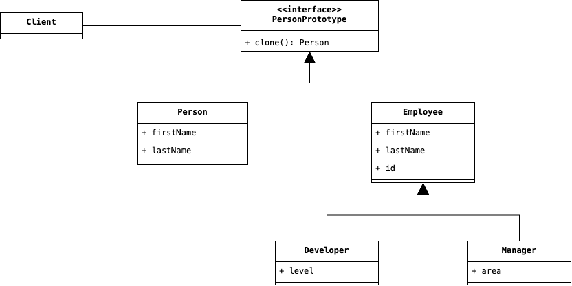

# Prototype
Spesso ci troviamo nella necessità di avere una copia esatta di un'entità e che sia completamente distaccata 
dall'originale. Prendiamo in considerazione un linguaggio OO come Java, in cui gli oggetti non solo altro che 
riferimenti a celle di memoria che contengono le informazioni di questi. Quest'implementazione del linguaggio fa in 
modo che ovunque venga inserito un'oggetto, che sia una collezione o un'altra funzione, ci si riferisca a questo 
attraverso un riferimento, e quindi, qualsiasi modifica avrà ripercussione sull'oggetto originale. Chiariamo con un 
esempio:

```java
import java.util.List;

public class Main {
    public static void main(String[] args) {
        final Person firstPerson = new Person("Mario", "Rossi");
        final Person secondPerson = new Person("Maria", "Verdi");

        final List<Person> authorizedPeople = List.of(firstPerson, secondPerson);
        final List<Person> unauthorizedPeople = List.of(secondPerson);

        System.out.println("Authorized People ...");
        for (Person person : authorizedPeople) {
            System.out.println(person.toString());
        }

        System.out.println("Unauthorized People ...");
        for (Person person : unauthorizedPeople) {
            System.out.println(person.toString());
        }
        
        firstPerson.setName("Mario Giuseppe");

        System.out.println("Authorized People ...");
        for (Person person : authorizedPeople) {
            System.out.println(person.toString()); // Mario Giuseppe Rossi ...
        }
    }
}
```

Nel codice precedente sono stati creati due nuovi oggetti di tipo `Person`. Successivamente, questi oggetti sono 
stati inseriti all'interno di due liste, rispettivamente `authorizedPeople` e `unauthorizedPeople`, tuttavia, 
ricordiamoci che non sono stati effettivamente inseriti questi oggetti all'interno delle liste, ma bensì dei 
riferimenti agli oggetti. Quest'accortezza fa in modo che, qualora si modifichi un oggetto, come è stato fatto in 
`firstPerson.setName("Mario Giuseppe");`, la modificha si ripercuota anche nel contenuto di `authorizedPeople`.

Una valida soluzione sarebbe stata quella di creare letteralmente un nuovo oggetto in questa maniera:

```java
final Person firstPersonCopy = new Person("Mario", "Rossi");
```

e successivamente modificare la copia ottenuta anzichè l'originale che è stato inserito nella collezione. Tuttavia, 
questa soluzione è possibile solamente in quanto l'esempio è molto semplice, quindi il numero di attributi della 
classe `Person` si limita ad un totale di due, ed inoltre, tutti questi potrebbero essere accessibile attraverso i 
relativi metodi getter. Tuttavia, in un caso reale gli attributi potrebbero essere molto più di due, in aggiunta, 
potrebbero essercene alcuni con visibilità privata e non accessibili attraverso dei getter. Come possiamo progettare 
una soluzione che permetta di clonare letteralmente un oggetto nascondendone il processo? 

Il Design Pattern Prototype si basa sulle considerazioni elencate precedentemente, e si basa sulla definizione 
di un'interfaccia condivisa denominata __Prototype__ che definisce un metodo di accesso comune a tutte le classi che 
vogliono poter essere clonate e che verranno denominate __Concrete Prototype__. La struttura del Design Pattern è 
descritta nella figura sottostante:

<div style="display: flex; justify-content: center; width: 100vw; padding: 1em 2em">
    
</div>

## Partecipanti
All'interno del Design Pattern, come mostrato dalla figura precedente, lavorano insieme le seguenti entità:

* L'interfaccia __Prototype__ rappresentata da `PersonPrototype` che definisce al suo interno il punto di accesso 
  attraverso cui clonare un oggetto, e che deve essere implementata da chiunque voglia che i propri oggetti possano 
  essere clonati.
* I __Concrete Prototype__ ossia gli attori che potranno essere effettivamente clonati e di cui fanno parte 
  `PersonPrototype` e `EmployeePrototype`, sono le classi concrete i cui oggetti potranno essere clonati.

## Conseguenze

L'uso di questo pattern condivide le proprie conseguenze con il Design Pattern Abstract Factory, che abbiamo già 
visto precedentemente:

1. <u>Astrazione del processo di clonazione di un oggetto.</u> Sollevando di conseguenza il Client dall'onere di 
   istanziare un nuovo oggetto partendo da uno precedente, ed inserendo al suo interno tutti gli attributi di 
   interesse, che rendono l'ultima un'effettiva copia del primo.
2. <u>Sollevare il Client dall'onere di creare un nuovo oggetto</u> usando ad esempio il Design Pattern Factory.
3. Comporta, tuttavia, lo svantaggio di <u>replicare la logica di clonazione</u>, anche se questa è relativamente 
   complicata da realizzare.