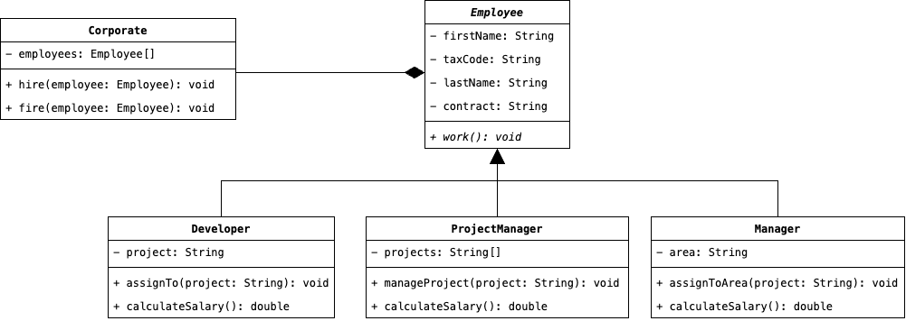

# Patterns Creazionali

Consideriamo il seguente scenario, coerentemente con un'applicazione gestionale. Un'azienda è composta da diversi 
__Impiegati__, a cui è assegnato un ruolo. Ad esempio, un Impiegato potrebbe essere uno __Sviluppatore__ 
un __Project Manager__ o un __Dirigente__ (lascio a voi una lista più esaustiva). A ciascun impiegato è ovviamente 
assegnato un particolare tipo di contratto, quale potrebbe essere un Full-Time o un Part-Time. Avendo in mente questa 
configurazione, proviamo a rappresentarla attraverso un Diagramma UML:



Immaginando di voler quindi implementare un'Azienda con diversi Impiegati, potremmo supporre che esista una 
classe denominata `CorporateFactory` che implementa al suo interno la logica per la creazione di un'azienda, 
idealmente, porebbe essere composta più o meno come segue:

```java
public class CorporateFactory {
    public void create() {
        final var corporate = new Corporate();
        
        final var developer = new Developer("Mario", "Rossi", "AB123CD");
        final var projectManager = new ProjectManager("Francesca", "Bruni", "CD098GB");
        final var manager = new Manager("Luigi", "Neri", "AL918OK");
        
        coporate.hire(developer);
        corporate.hire(projectManager);
        corporate.hire(manager);
    }
}
```

Fino a questo punto non ci sono problemi, il codice funziona correttamente e non sembrano esserci bug o mancanze 
nell'implementazione dei nostri ipotetici requisiti. Quello che manca però è la <u>flessibilità all'interno del 
codice</u>. Supponiamo infatti che volessimo modificare il codice precedente in modo tale che vengano assunti 
solamente Dipendenti con contratto part-time; una soluzione ragionevole sarebbe quella di eseguire l'override del 
metodo `create` ed implementare al suo interno la nuova logica che vogliamo. Il problema risiede proprio in 
quest'ultima affermazione, ossia la necessità di modificare o riscrivere il codice precedente ogni volta che 
vogliamo eseguire una modifica. 

Sia chiaro che quindi i Design Pattern Creazionali <u>non aiutano lo sviluppatore a scrivere codice più efficiente 
oppure a ridurne complessivamente la struttura</u>, ma aiutano invece a creare una soluzione che sia riusabile, e quindi meno 
affetta a cambiamenti futuri che potrebbero stravolgerne il funzionamento.

All'interno della famiglia dei Design Pattern Creazionali, sono presenti i seguenti Pattern:
* Il Design Pattern __Abstract Factory__ risolve il problema riguardante la creazione di oggetti appartenenti a 
  diverse gerarchie di classi. Questo patter, come vedremo, è in realtà una specializzazione di uno già presente, 
  ossia il Design Pattern Factory Method.
* A tal proposito, il Design Patten __Factory Method__ astrae il processo di creazione di un'oggetto, sollevando il 
  client dall'onere di istanziare esplicitamente ciascun oggetto richiesto e di configurarlo correttamente.
* Un Design Pattern che molto spesso si incontra in gran parte dei framework (penso ad esempio a Spring e Laravel) è 
  il __Singleton__. Diversamente dagli altri due Design Pattern, il seguente definisce come poter creare un'unica 
  istanza di un oggetto disponibile per tutta l'applicazione.
* Spesso, il processo di creazione di un oggetto passa attraverso diversi step, i quali non possono essere definiti 
  tutti all'interno di un costruttore, sopratutto perché sono essi stessi una parte dinamica dell'oggetto. 
  L'astrazione del processo di creazione di un oggetto è il cuore del Design Pattern __Builder__.
* Infine, il cambiamento della struttura stessa di un oggetto, può essere realizzato mediante prototipizzazione 
  degli elementi interni costituenti lo stesso. Il processo di selezionamento e di divisione dello stato interno di 
  un oggetto viene spiegato attraverso il Design Pattern __Prototype__.