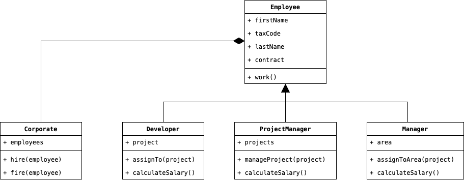

# Patterns Creazionali

Consideriamo il seguente scenario, coerentemente con un'applicazione gestionale. Un'azienda è composta da diversi 
__Impiegati__, a cui è assegnato un ruolo. Ad esempio, un Impiegato potrebbe essere uno __Sviluppatore__ 
un __Project Manager__ o un __Dirigente__ (lascio a voi una lista più esaustiva). A ciascun impiegato è ovviamente 
assegnato un particolare tipo di contratto, quale potrebbe essere un Full-Time o un Part-Time. Avendo in mente questa 
configurazione, proviamo a rappresentarla attraverso un Diagramma UML:

<div style="display: flex; justify-content: center; width: 100vw; padding: 1em">
    
</div>

Immaginando di voler quindi implementare un'Azienda con diversi Impiegati, potremmo immaginarci che esista una 
classe denominata `CorporateFactory` che implementa al suo interno la logica che vorremmo, più o meno come segue:

```java
public class CorporateFactory {
    public void create() {
        final Corporate corporate = new Corporate();
        
        final Developer developer = new Developer("Mario", "Rossi", "AB123CD");
        final ProjectManager projectManager = new ProjectManager("Francesca", "Bruni", "CD098GB");
        final Manager manager = new Manager("Luigi", "Neri", "AL918OK");
        
        coporate.hire(developer);
        corporate.hire(projectManager);
        corporate.hire(manager);
    }
}
```

Fino a questo punto non ci sono problemi, il codice funziona correttamente e non sembrano esserci bug o mancanze 
nell'implementazione dei nostri ipotetici requisiti. Quello che manca però è la flessibilità all'interno del codice. 
Supponiamo infatti che volessimo modificare il codice precedente in modo tale che vengano assunti solamente 
Dipendenti con contratto part-time; una soluzione ragionevole sarebbe quella di eseguire l'override del metodo 
`create` ed implementare al suo interno la nuova logica che vogliamo. Il problema risiede proprio in quest'ultima 
affermazione, ossia la necessità di modificare o riscrivere il codice precedente ogni volta che vogliamo eseguire 
una modifica. 

Sia chiaro che quindi i Design Pattern Creazionali <u>non aiutano lo sviluppatore a scrivere codice più efficiente 
oppure a ridurne complessivamente la struttura</u>, ma aiutano invece a creare una soluzione che sia riusabile, e quindi meno 
affetta a cambiamenti futuri che potrebbero stravolgerne il funzionamento. 

Nell'implementazione dei vari Design Patterns vedremo che questi implicheranno modifiche alla classe 
`CorporateFactory` e che la combinazione delle varie modifiche (per necessità dettate da diversi scenari) 
defineranno il particolare tipo di Design Pattern da implementare.
