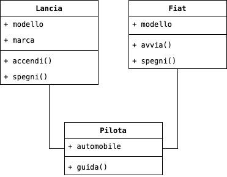
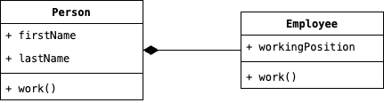

# Design Patterns

Una delle caratteristiche principali che permette di distinguere una figura senior da una junior, è la capacità di
risusare soluzioni per problemi che si sono incontrati in passato. Ovviamente, l'ingrediente fondamentale per
acquisire questa capacità è sicuramente l'esperienza e quindi il tempo trascorso sul campo. Tuttavia, nell'ambito
dell'Ingegneria del Software, con il tempo si è arrivati a redigere un vero e proprio protuario di soluzioni ricorrenti
denominati __Patterns__.

Il termine Pattern deriva principalmente dall'ambito architettonico, ma fortunatamente con il tempo si è arrivati
all'adattamento di questo concetto anche nell'ambito informatico. Se dovessimo dare una definizione formale al concetto
di Pattern diremo che questo è *una soluzione efficace e comprovata per un problema ricorrente*.

I __Design Patterns__ sono quindi degli schemi di progettazione basati su Pattern, e vengono classificati sulla base di
due criteri: seguendo il loro scopo; oppure il raggio di azione. Comunemente, siamo abituati ad usare la classificazione
attraverso il loro scopo, la quale prevede l'identificazione di tre categorie di Design Patterns:

* __Design Patterns Creazionali__, riguardanti il processo di creazione degli oggetti: _Abstract Factory_, _Builder_,
  _Factory_, _Prototype_ e _Singleton_.
* __Design Patterns Strutturali__, riguardanti la composizione di classi ed oggetti: _Adapted_, _Bridge_, _Composite_,
  _Dectorator_, _Facade_, _Flyweight_ e _Proxy_.
* __Design Patterns Comportamentali__, definiscono le modalità con cui le classi e gli oggetti interagiscono tra di 
  loro, e sono quindi in grado di distribuire le responsabilità: _Chain Of Responsabilities_, _Command_, 
  _Interpreter_, _Iterator_, _Mediator_, _Memento_, _Observer_, _State_, _Strategy_, _Template Method_ e _Visitor_.

## Le Ragioni per cui usare i Design Patterns

Prima di tuffarci direttamente nell'esaminare i Design Patterns e divertirci nel trovare un punto della nostra
applicazione in cui potrebbero essere applicati, sarebbe utile a chiunque lavori con questi concetti teorici
sviluppare un senso critico, e quindi domandarsi perché sarebbe necessario introdurre i Design Pattern all'interno
della nostra applicazione. Vediamo quindi due punti, a mio parere fondamentali, che ci permettono di descrivere in
breve l'utilità dell'applicazione dei Design Pattern:

* Utilizzare i Design Patterns <u>facilita la progettazione e l'ideazione della soluzione da adottare</u>, fornendo una
  soluzione comune a problemi di rappresentazione del dominio di interesse. Spesso infatti, nella codifica del dominio
  di interesse dell'applicazione, sono presenti concetti teorici che non hanno una diretta traduzione in termine di
  classi o interfaccie; ad esempio, potremmo citare una particolare composizione di un algoritmo che si applica in
  diverse configurazioni di un'entità; oppure, un oggetto mutevole, che viene costruito nel tempo anziché avere una
  struttura fissa stabilita un sede di progettazione.

* L'applicazione dei Design pattern <u>favorisce la progettazione per il cambiamento</u>. Quando lavoriamo in 
  applicazione enterprise che nel tempo possono subire molti cambiamenti e di diversa natura, è necessario evitare di 
  rendere il codice un agglomerato di entità ed algoritmi; di conseguenza, esponendo questo a seri problemi qualora si implementa
  una modifica anche in una classe periferica. Fortunatamente, i Design Pattern si basano su concetti teorici dell'OOP
  come polimorfismo ed incapsulamento, il cui scopo è definire i limiti di visibilità dei dettagli di un'entità
  software,
  evitando quindi che troppe informazioni critiche vengano esposte ad altre entità, dunque, impedendo che un cambiamento
  nelle prime possa implicare un cambiamento anche nelle seconde.

## Due Concetti Teorici Fondamentali

Capisco che il catalogo dei Design Pattern sia di una notevole dimensione, e che di conseguenza ricordare tutti i
Pattern potrebbe essere un lavoro tedioso. Tuttavia, i Design Pattern si basano su due concetti teorici comuni,
e che aiutano nella comprensione del funzionamento alla base di questi:

1. _Si deve sempre programmare riferendosi ad un'interfaccia, non all'implementazione_.
2. _Favorire la composizione di oggetti rispetto all'ereditarietà di classe_.

Prendiamo in considerazione questo primo diagramma UML:

    

In questo specifico esempio, la classe __Pilota__ si riferisce direttamente ad un oggetto appartenente ad una delle
due classi `Lancia` o `Fiat`. Entrambe queste classi, hanno diversi metodi per permettere al Pilota di poter
espletare il suo compito, questo implica che, tutte le volte in cui un Pilota dovrà cambiare riferimento ad un
automobile, il relativo codice dietro il suo funzionamento, dovrà essere cambiato. Se invece avessimo fatto in modo
che un Pilota si fosse riferito ad un'interfaccia comune alle due classi, e che ipoteticamente avremo denominato con
il nome di `Automobile`, non ci sarebbero stati problemi nel modificare quale Automobile il Pilota dovrà guidare.

Sebbene l'ereditarietà sia uno dei principi fondamentali dell'OOP, l'uso di questa può comunque portare degli svantaggi
all'interno del nostro codice. Consideriamo l'esempio più banale, una classe `Person` e la sotto classe `Employee`,
con Person che contiene al suo interno il metodo `work` automaticamente ereditato da Employee. Questo meccanismo di
ereditarietà fa in modo che Employee acceda direttamente all'implementazione del metodo work, violando il Principio
dell'Incapsulamento, ed implementando un forte legame tra le due classi, tale che, una modifica all'interno del metodo
work della classe Person, impatterebbe direttamente sulla classe Employee. In termini grafici, potremmo definire questo
scenario usando il seguente schema:

    

In gergo, si dice che è stata realizzata una relazione del tipo __is-a__. Se, invece, avessimo usato la
composizione, e quindi trasformando la relazione da is-a a __has-a__, saremo stati in grado di disacoppiare le due
classi, permettendo alla classe Employee di non accedere all'implementazione di Person, e riducendo l'impatto delle
modifiche sulla classe padre. 
