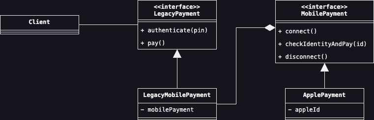

# Adapter  
Lo scopo di questo Design Pattern è di poter offire una conversione di un'intefaccia verso un'altra. Uno scenario 
simile avviene spesso in applicazioni legacy che hanno dipendenze verso vecchie versioni di altre applicazioni o 
librerie e di cui un aggiornamento radicale potrebbe richiedere troppe risorse per poter essere realizzato in questo 
momento. Consideriamo infatti il seguente scenario: la nostra applicazione utilizza una serie di metodi di pagamento 
che possiamo identificare in `CashPayment`, `CreditCardPayment` e `CheckPayment`, tuttavia, vogliamo introdurre una 
nuova modalità di pagamento chiamata `ApplePayment`. Il problema alla base di questo esempio è che `CashPayment`, 
`CreditCardPayment` e `CheckPayment` dipendono dall'interfaccia `LegacyPaymentMethod`:

```java
public interface LegacyPaymentMethod {
    boolean authenticate(String pin);
    void pay();
}
```

mentre, il nuovo metodo di pagamento `ApplePayment` si basa su un'interfaccia diversa:

```java
public interface MobilePayment {
    void connect();
    void checkIdentityAndPay(String id);
    void disconnect();
}
```

L'integrazione di questa nuova funzionalità all'interno della nostra applicazione, passa attraverso l'uso di questo 
pattern, il quale richiede che venga definita una nuova classe, che idealmente potremmo chiamare 
`LegacyMobilePayment` la quale estende l'interfaccia `LegacyPayment`(da adesso nota come __Target__) e che prenderà il 
nome di __Adapter__. A sua volta, la nuova classe Adapter conterrà al suo interno un riferimento ad un'istanza di 
`MobilePayment`, che potrebbe essere la classe da integrare nota come `ApplePayment` e che prenderà il nome di 
__Adaptee__. 

In termini grafici, il Design Pattern è organizzato come segue:

<p style="display: flex; justify-content: center">
    
</p>

## Partecipanti 
All'interno di questo Design Patter recitano i seguenti partecipanti:

* Il __Target__ `LegacyPayment` rappresenta l'effettiva interfaccia a cui bisogna adattare un'interfaccia avente 
  una diversa struttura.
* L'__Adapter__ sarà la nostra classe adattatrice ossia la classe `LegacyMobilePayment` che implementa l'interfaccia 
  __Target__ e che contiene al suo interno un riferimento all'interfaccia da adattare.
* L'interfaccia da adattare è chiamata invece __Adaptee__, letteralmente "Adattato", e che nel nostro caso 
  rappresenta l'interfaccia `MobilePayment`.

## Conseguenze
L'applicazione dell'Adapter ha come pricipale conseguenza all'interno del nostro codice, quella di aumentare la 
capacità di riuso di codice precedente, in modo tale da inserire un livello di astrazione successivo che permetta di 
lavorare senza fare ipotesi astratte su ciò che accade dietro le quinte. 