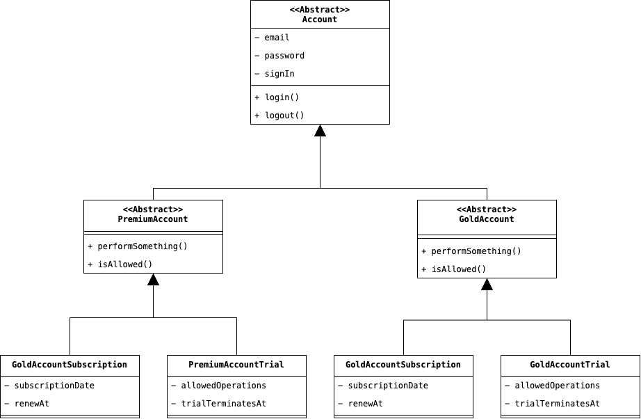
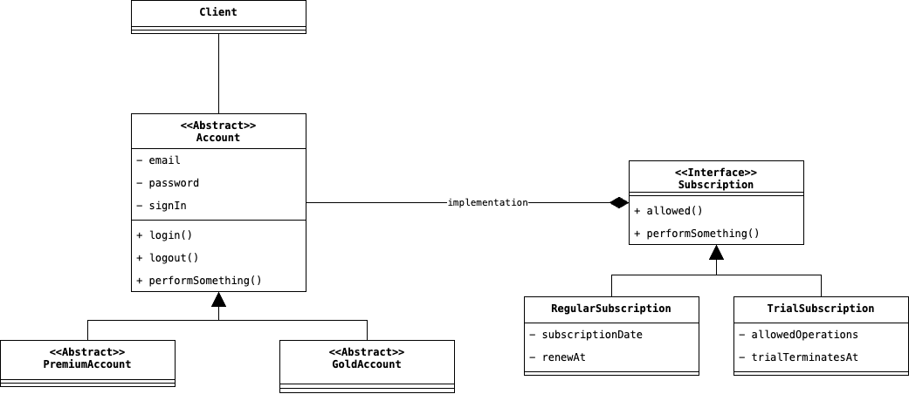

# Bridge
> Il Design Pattern Bridge disaccoppia l'astrazione dall'implementazione, in modo tale che entrambe possano variare
> indipendentemente l'una dall'altra. 
> 
> <cite>Design Patterns. Elementi per il riuso di software ad oggetti. p.152</cite>

Questa definizione data del libro della GoF a primo impatto può risultare molto difficile da comprendere, sopratutto 
se è la prima cosa che si legge di questo Design Pattern. Quindi, proviamo a capire meglio cosa voglia dire, 
partendo da un esempio.

La nostra applicazione permette di accedere al servizio attraverso diverse sottoscrizioni, le quali assegnano 
diversi tipi di risorse all'utente. Ad esempio, al momento sono state implementate due tipi di sottoscrizioni, 
ossia: __Premium__ e __Gold__. Tuttavia, un utente ha diritto a 30 giorni di prova nel caso lo desiderasse. Essendo 
che a ciascun utente viene assegnato un account, un modo per rappresentare questa struttura gerarchica della nostra 
applicazione potrebbe essere quella mostrata nel diagramma sottostante:

    

All'interno di questo diagramma, l'Astrazione è rappresentata da tutte le classi astratte che forniscono una 
rappresentazione concettuale di alto livello, ossia le classi `Account`, `PremiumAccount` e `GoldAccount`. D'altro 
canto, l'Implementazione è rappresentata da tutte le restanti classi che effettivamente le operazioni a basso 
livello che sono implementabili all'interno di un'Astrazione, ossia: `PremiumAccountSubscription`, 
`PremiumTrialSubscription`, `GoldAccountSubscription` e `GoldTrialSubscription`.

Implementare una struttura di questo tipo è sicuramente problematico, basti pensare solamente al caso in cui si 
aggiungesse un terzo tipo di sottoscrizione (chiamata ad esempio __Silver__). Oppure si voglia aggiungere un ulteriore 
periodo di prova con altre features e con un intervallo temporale diverso. Il concetto alla base del Design Pattern è 
quindi quello di <u>separare queste due gerarchie innestate di classi, in due gerarchie separate, permettendo tuttavia, 
che esista un collegamento tra queste due</u>, onde evitare che si perda la relazione definita nella vecchia versione 
della gerarchia. L'implementazione del Design Pattern, quindi, si basa sul seguente schema:

    

Notiamo come abbiamo effettivamente separato l'astrazione le sue raffinazioni (che rappresentano un __Account__ e le 
sue specializzazione), dalle effettive implementazioni che verranno usate nella nostra applicazione. Infatti, il 
__Client__ accede a questa struttura utilizzando un'astrazione di Account, a cui verrà indicato successivamente, 
quale implementazione particolare questa dovrà utilizzare durante l'esecuzione.

## Partecipanti
Come possiamo vedere dal diagramma, all'interno del Design Pattern sono presenti i seguenti attori:

* L'__Abstraction__ che definisce l'interfaccia comune a tutte le nostre astrazioni, ed è rappresentata dalla classe 
  `Account`.
* Il __Refined Abstraction__ è un'astrazione corrente che viene utilizzata nella nostra applicazione, ad esempio, 
  per l'Utente corrente quest'entità è rappresentata da `PremiumAccount` o `GoldAccount`.
* Se l'Abstraction definisce le operazioni di alto livello della nostra applicazione, l'interfaccia __Implementor__ 
  definisce invece le operazioni specifiche che possono essere svolte da ciascuna singola implementazione. 
  L'Implementor è infatti la classe `Subscription`, la quale definisce quali effettive operazioni potranno compiere 
  le nostre implementazioni, all'interno dell'applicazione.
* Infine, il __Concrete Implementor__, ossia le classi `RegularSubscription` e `TrialSubscription`, sono le 
  effettive implementazioni che verranno utilizzate da un'astrazione.

## Conseguenze
Oltre che all'immediata conseguenza pratica di separare l'astrazione dalle implementazioni, l'uso di questo Design 
Pattern ha come risultato quello di:

1. <u>Evitare l'uso di costrutti ereditarietari innestati</u>, i quali, come abbiamo visto, al crescere della 
   complessità dell'applicazione, potrebbero rappresentare un collo di bottiglia nella manutenibilità del codice. 
   Ricordiamo infatti che, differentemente dalla Composozione, l'Ereditarietà è un legame forte, difficilmente 
   malleabile qualora sia richiesta una modifica.
2. Si permette anche di <u>cambiare a tempo di esecuzione un'implementazione rispetto ad un'altra</u>, evitando 
   quindi che sia necessario ricompilare il codice (qualora siamo in presenza di un linguaggio compilato), in quanto 
   l'implementazione è legato alla nostra astrazione corrente come un semplice riferimento.
3. La separazione di Astrazione e Implementazione permette di <u>estendere arbitrariamente uno dei due concetti</u>, 
   senza che l'estensione di questi abbia delle ripercussioni concrete su tutto il codice.
