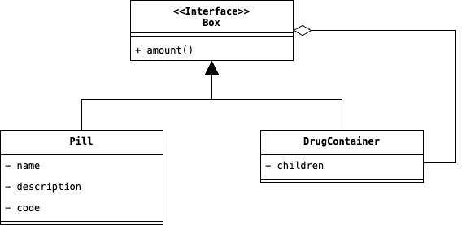

# Composite

Immaginiamo il seguente scenario: in un'applicazione medica, ciascun Paziente possiede una Cassetta dei Farmaci. A 
sua volta una Cassetta dei Farmaci potrebbe contenere una singola Pillola, oppure una Scatoletta di Pillole. Inoltre, 
una Scatoletta di Pillole può contenere un'altra Scatoletta oppure un insieme di Pillole. Ciascun oggetto di questa 
gerarichia, possiede un prezzo, che può essere un prezzo specifico come nel caso della Pillola, oppure un prezzo 
composto dato dalla somma dei prezzi specifici del suo contenuto, come nel caso della Scatoletta di Pillole. 
Essendo noi interssati a calcolare il totale di una Cassetta dei Farmaci, Come possiamo codificare uno scenario di 
questo tipo nella nostra applicazione? Una possibile soluzione potrebbe essere questa:

```java
import java.util.ArrayList;

public class DrugContainer {
    private List<Pill> pills;
    private List<Box> boxes;

    public DrugContainer() {
        this.pills = new ArrayList<Pill>();
        this.boxes = new ArrayList<Box>();
    }
    
    public void add(Pill pill) {
        this.pills.add(pill);
    }
    
    public void add(Box box) {
        this.boxes.add(box);
    }
    
    public short total() {
        final var totalPills = this.pills.stream().map((pill) -> pill.amount());
        final var totalBoxes = this.boxes.stream().reduce(0, (acc, box) -> acc + box.total(), Integer::sum);
        return (short)(totalPills + totalBoxes);
    }
}

public class Box {
    private List<Pills> pills;

    public Box() {
        this.pills = new ArrayList<Pill>();
    }
    
    public int total() {
        return this.pills.stream().map((pill) -> pill.amount());
    }
}
```

La soluzione proposta è perfettamente praticabile, tuttavia manca di elasticità. Nel caso in cui si volesse inserire 
un nuovo tipo di contenitore alternativo a `Box`, sarebbe necessario modificare il codice di `DrugContainer`.
Inoltre, per come abbiamo risolto il problema principale, il Client deve necessariamente trattare separatamente un 
`Box` da un `DrugContainer`, senza offrire alcuna flessibilità nel trattare un entità al posto dell'altra. 

Il Design Pattern Composite si basa proprio sull'ultima problematica esposta. Il Design Pattern, infatti, permette 
di trattare come un'unica entità il contenuto ed il contenitore, inserendo all'interno dell'ultimo, un riferimento 
ad una collezione di elementi primitivi che rappresentano, appunto, il contenuto del contenitore, ossia, come nel caso 
precedente, la classe `Pill`. L'organizzazione del Design Patter è la seguente:

<p style="display: flex; justify-content: center">
    
</p>

## Partecipanti

Come descritto nella figura precedente, all'interno di questo Design Pattern sono contenuti i seguenti attori:

* Il __Component__ rappresentato dall'interfaccia `Box` è l'astrazione che permette di trattare indistintamente, 
  come se fossero un unico oggetto un'implementazione `Pill` e un `DrugContainer`. All'interno di questa astrazione, 
  è definito anche il comportamento standard che tutte le implementazioni dovranno esporre, nel nostro caso, questo 
  è il metodo `amout`.
* Un __Leaf__ è invece un oggetto foglia della nostra composizione, ossia: un oggetto atomico che non può contenere 
  al suo interno altri oggetti. Nel caso specifico il Leaf è rappresentato dalla nostra classe (ossia 
  l'implementazione) `Pill`.
* Infine, il __Composite__, ossia la classe `DrugContainer` contiene al suo interno delle implementazioni annidate che 
  potrebbero essere degli oggetto di tipo Pill o a loro volta di tipo Composite. Per implementare il comportamento 
  esposto dall'astrazione, deve chiamare ricorsivamente il metodo amount, su tutti i figli che sono contenuti al suo 
  interno. 

## Conseguenze

Applicare il Design Pattern Composite all'interno del nostro codice, ci espone alle seguenti conseguenze:

1. Permette di <u>implementare gerarchie di oggetti composti</u>. In questo modo, in tutti i punti in cui il Client 
   si aspetta un Leaf, sarà possibile utilizzare anche un Composite.
2. <u>Semplifica il Client</u>, che non dovrà usare strutture di controllo aggiuntivi per discriminare l'uso di un 
   Left da un Composite.
3. <u>Facilita l'inserimento di nuove gerarchie di oggetti</u>, trattando questi come se fosse unicamente 
   sottoclassi della classe Component.
4. Tuttavia, <u>rende il progetto troppo generico</u>. A volte, infatti, in una gerarchia relativamente complessa, 
   si vorrebbe permettere che un Composite possa contenere solamente degli oggetti di un Leaf specifico, cosa non 
   realizzabile con l'implementazione di questo Design Pattern.

## Considerazioni
Nell'implementazione di questo Design Pattern, voglio condividere alcune considerazioni tratte anche dal testo, 
utili per imparare quando attuare una scelta rispetto ad un'altra. Se considerassimo la versione più "generale" del 
Design Pattern, probabilmente noteremo una differenza sostanziale nella struttura di questo: ossia, che il maggior 
numero di operazioni condivisibili è implementato all'interno dell'astrazione Component, rispetto 
all'implementazione corrente, che vede la dichiarazione all'interno di Component solamente delle operazioni 
indispensabili e condivisibili tra un Leaf o un Composite. La scelta su quale delle implementazioni usare dipende 
sostanzialmente da alcuni due fattori: sicurezza e trasparenza.

* Implementare il maggior numero di operazioni all'interno del Component rende la struttura complessivamente più 
  trasparente al Client. Una considerazione di notevole spessore se considerando anche che l'obiettivo del Design 
  Pattern è quello di rendere il più trasparente possibile al Client la distinzione tra Leaf e Composite. Tuttavia, 
  espone il codice a problemi di sicurezza, infatti, si rischia che il Client applichi operazioni teoricamente 
  impraticabili per un Leaf o viceversa per un Compisite.
* Diversamente, implementare il minor numero di operazioni condivisibili all'interno del Component, garantisce una 
  maggiore sicurezza in quanto è impossibile in linguaggi a tipizzazione statica come Java, che si invochimo metodi 
  non permessi sulla classe Leaf, pena la sollevazione di errori a tempo di compilazione. D'altro canto, però il 
  codice ne risulta in termini di flessibilità, il che richiederebbe una maggiore attenzione e di impossibilità 
  d'uso intercabiabile delle classi.

La scelta finale sicuramente dipende dal progettista e dalle sue considerazioni. Personalmente, all'interno dei 
progetti aziendali, preferisco ridurre la flessibilità a favore della sicurezza per evitare l'incombere di 
situazioni sgradevoli durante l'uso da parte del Client.