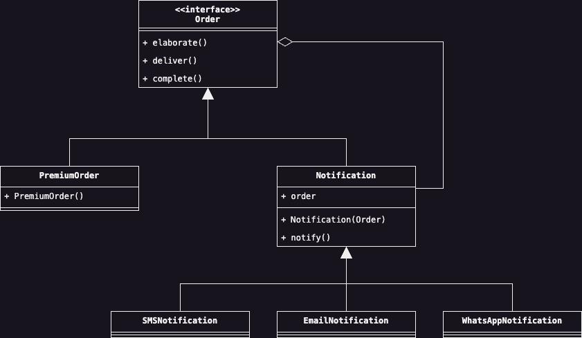

# Decorator
Nella maggior parte dei casi, ciascuno di noi ha visto questo Design Pattern essere usato nella vita quotidiana 
senza essersene mai accorto. In un'ipotetica applicazione che permette di consegnare un generico ordine, vogliamo 
implementare un sistema di alert che permetta ad un Utente di essere avvertito non appena un Ordine cambia di stato. 
Procediamo quindi a creare la classe `Order` e ad inserire al suo interno un oggetto di una classe che invii un'email 
non appena l'ordine cambia di stato. Tuttavia, con il passare del tempo, sono stati implementati diversi meccanismi 
con cui poter inviare una notifica all'Utente, i quali spaziano da un semplice SMS fino ad un messaggio WhatsApp. 
A questo punto non diventa più praticabile continuare a creare combinazioni di classi da inserire come dipendenza 
verso la classe `Order`, in quando, dovremmo creare una classe per ogni combinazione, ad esempio: 
`SMSAndWhatsAppNotification`, `SMSAndWhatsAppAndEmailNotification` e così via. Dobbiamo escogitare un modo per poter 
comporre dinamicamente queste classi senza doverle definire in maniera static.

L'ultima frase racchiude proprio la chiave con cui possiamo risolvere il problema. Per prima cosa dobbiamo fare in 
modo che sia un `Order` che una `Notification` appartengano alla stessa interfaccia, in questo modo, sfruttando il 
Polimorfismo possiamo tratte un'istanza di un `Order` esattamente come se fosse istanza anche di `Notification`. 
Inoltre, dobbiamo anche permettere che un'azione evocata su un oggetto di tipo `Order` venga propagata anche agli 
oggetti di tipo `Notification`.

Riorganizziamo allora le nostre idee in termini grafici, ottenendo il Diagramma UML sottostante:

    

La cosa importante da notare nel grafico è che ciascuna sottoclasse di `Notification` deve avere un costruttore che 
accetta necessariamente un oggetto di tipo `Order`. In questa maniera, non sarà possibile istanziare un oggetto di 
`Notification` senza che questo contenga un riferimento ad un oggetto di tipo `Order` concreto che non sia un 
`Notification`. Inoltre, la catena di `Notification` che si viene a creare è tale che all'invocazione di un metodo 
di `Notification` debba essere invocato un metodo dell'oggetto contenuto al suo interno, il quale propagherà 
l'evento fino all'ultimo anello della catena. 

## Partecipanti
All'interno di questo Design Pattern, gli attori che vediamo nella figura precedente, assumono i seguenti nomi:

* Il __Component__ ossia `Order` è l'interfaccia comune attraverso la quale possono essere sia creati i decoratori 
  che gli oggetti finali da decorare.
* Chi verrà decorato sarà il __Concrete Component__, cioè la classe `PremiumOrder`.
* Il decorante prende il nome di __Decorator__, cioè l'oggetto che dovrà essere aggangiato ad un __Concrete 
  Component__ ed è rappresentato dalla classe `Notification`.
* Infine, i decoratori concreti che verranno usati nell'applicazione, sono chiamati __Concrete Decorator__ e sono 
  effettivamente tutte le sotto-classi della classe astratta `Notification`.

## Conseguenze
L'uso di questo Design Pattern ha un'impatto sul nostro codice misurabile attraverso le seguenti conseguenze.

1. Come detto precedentemente, definire classi in termini di decoratori ha il vantaggio di <u>evitare l'implementazione 
   di diverse combinazioni possibili</u> di una stessa classe sulla base delle nostre esigenze.
2. <u>Semplifica la definizione delle classi nella gerarichia</u>. In questo modo, ciascuna classe che deve essere 
   decorata, non deve obbligatoriamente mantere un riferimento al proprio decoratore, quindi, le funzionalità da 
   implementare o rimuovere possono essere definite in maniera completamente flessibile rispetto all'implementazione 
   dell'oggetto da decorare.
3. D'altro canto si andrebbe a creare una <u>grande quantità di micro-classi</u>, ciascuna delle quali andrebbe ad 
   implementare una funzionalità specifica. Un compromesso accettabile se parliamo di un numero di classi 
   relativamente ridotto, ma da tenere sotto controllo in quanto la soluzione potrebbe portare ad un esplosione del 
   numero di decoratori, con un impatto sulla manutenibilità complessiva.

