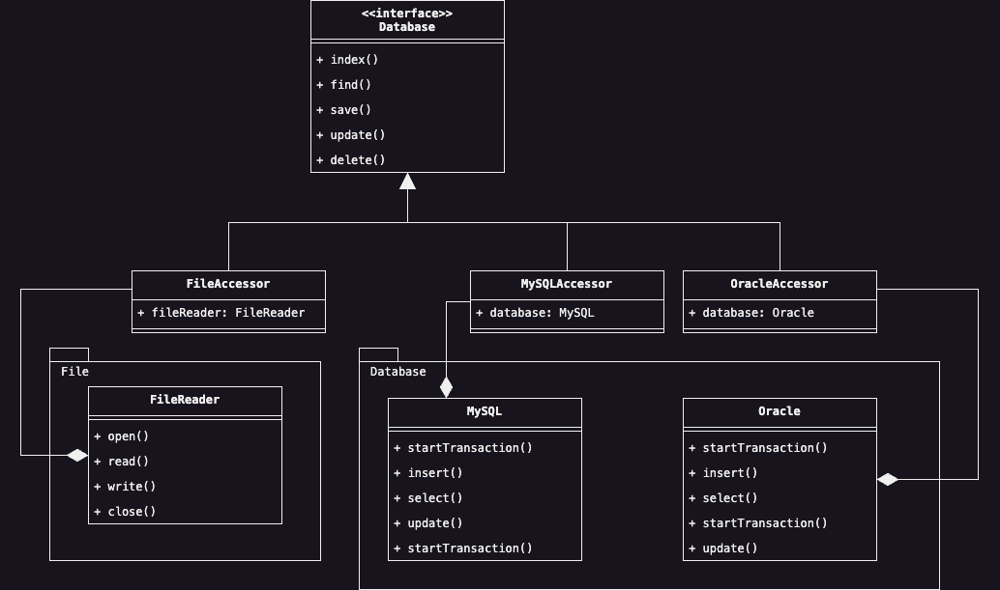

# Facade
In realtà operative, spesso ci si trova ad integrare un nuovo componente software con tutto un ecosistema 
precedentemente sviluppato. Ad esempio, spesso nei software legacy si costruiscono nuove funzionalità basandosi su 
layer precedenti che sono stati già testati e sono in produzione. Il Design Pattern Facade si basa proprio su 
quest'ultimo scenario (se volessimo tradurlo letteralmente potremmo usare il termine "Facchino"), ossia, crea un 
punto di accesso unico per l'uso di un modulo o un gruppo di funzionalità.

Consideriamo il seguente esempio: stiamo sviluppando un'applicazione che utilizza diversi sistemi di archiviazione, 
che si basano sul semplice foglio elettronico fino all'uso di una gamma di database relazionali quali ad esempio: 
Oracle, MySQL o SQL Server. Vogliamo rendere la nostra applicazione indipendente da quale sia la sorgente di dati e 
fare in modo tale da interagire con una sorgente di dati specifici a nostra scelta. L'idea quindi è quella di 
gestire questo ecosistema di sistemi di archiviazione usando un'unica interfaccia di accesso denominata `Database`. 
Le specializzazioni di quest'interfaccia, sono specifiche per ciascuna sorgente di dati, e possono essere cambiate a 
tempo di esecuzione a nostra scelta.

    

Nel diagramma precedente ho voluto applicare un ulteriore livello di astrazione per rappresentare il Design Pattern. 
Oltre all'interfaccia `Database` che rappresenta l'astrazione di un Facade, le varie implementazioni `FileAccessor`, 
`MySQLAccessor` e `OracleAccessor` che rappresentano i Facade veri e propri, sono tra loro interscambiali, 
permettendoci di usare un Facade al posto di un altro su nostra richiesta. Uno step aggiuntivo sarebbe quello di 
inserire anche una classe Factory che ci permetta di ottenere la giusta istanza del Facade, senza doverso 
esplicitamente istanziarlo.

## Partecipanti
In maniera relativamente semplice, all'interno di questo Design Patterns recitano i seguenti partecipanti:

* Il __Facade__ rappresentato dalla classe `Database` è il collante tra il Client e le restanti classi del 
  sottosistema con cui bisogna dialogare.

* Le rimanenti classi con cui bisogna dialogare rappresentano le __Subsystem classes__, le quali non hanno nessuna 
  conoscenza dell'esistena del Facade e che non mantengano nessun riferimento verso di esso.

## Conseguenze
Applicare questo specifico Design Pattern, si ottengono le seguenti conseguenze all'interno della nostra applicazione:

* <u>Ridurre i componenti con cui il Client deve comunicare</u>, rendendo quindi l'intero sottosistema da utilizzare 
  relativamente più semplice.
* Disaccoppiare le classi che fanno uso del Facade da quelle che sono usate dal Facade stesso, consente di 
  <u>modificare le classi del sottosistema senza che il Client ne fosse direttamente coinvolto</u>.