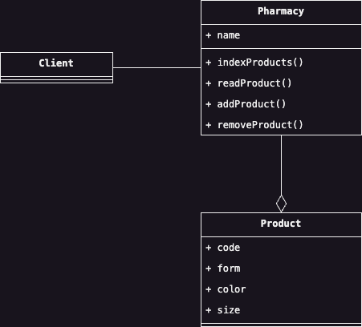
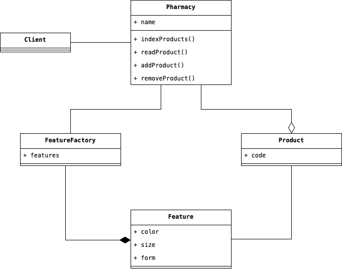

# Flyweight
Abbiamo appena realizzato un'applicazione che permette ad una farmacia di mantenere lo storico dei prodotti presenti 
nel proprio magazzino. Ciascun prodotto è identificato da una serie di campi, che per semplicità limiteremo a: 
codice, colore, forma e dimensione. Tuttavia, una particolare farmacia si trova all'interno di una città molto 
grande e per servire appropriatamente tutti i suoi clienti ha un magazzino di diversi metri quadrati con all'interno 
all'incirca 1.000.000 di prodotti. In una realtà di questo tipo, in cui il carico lavorativo è particolarmente alto, 
sarebbe opportuno domandarsi se sul lungo periodo la soluzione che abbiamo adottato sia quella corretta. Per il 
momento, abbiamo applicato alla lettera i principi della Programmazione Orientata agli Oggetti, ed abbiamo 
codificato all'interno di diverse classi il nostro dominio applicativo, ottenendo come risultato il diagramma UML 
sottostante.

    

Tuttavia, possiamo notare come spesso all'interno della classe `Product`, si ripetono pattern ricorrenti 
collegati agli attributi `form`, `color` e `size`. Considerando quindi che all'incirca nella nostra applicazione ci 
sono 1.000.000 di oggetti di tipo `Product`, non sarebbe opportuno ridurre le dimensioni degli oggetti memorizzando 
separatamente gli attributi `form`, `color` e `size` in modo tale da poter riusare diverse combinazioni di questi 
all'interno di uno stesso oggetto di tipo `Product`?

Il Design Pattern Flyweight si basa su quest'ultima considerazione, ed il suo scopo è proprio quello di ottimizzare 
l'uso di risorse all'interno della nostra applicazione, utilizzando una specie di repository centralizzata chiamata 
appunto Flyweight. Al suo interno, Flyweight memorizza quelle informazioni ricorrenti che possono essere condivise 
senza problemi con gli oggetti, e che prende il nome di __stato estrinseco__ dell'oggetto Flyweight, mentre, 
l'entità che farà uso del Fliweight (nel nostro caso la classe `Product`), codificherà al suo interno lo __stato 
intrinseco__, ossia, quelle informazioni che identificano l'entità stessa e che non vengono condivise tra le altre 
entità dell'applicazione.

Spesso, tuttavia, si vuole poter nascondere al Client il Design Pattern, facedo in modo che sia a conoscenza 
solamente di un'entità senza sapere che questa ha uno stato condiviso con un Flyweight. Per implementare questo, è 
necessario che non sia in grado di istanziare direttamente un Flyweight, ma che possa accedervi utilizzando una 
classe Factory, al cui interno, spesso, viene codificata una struttura dati associativa, che restituisca un 
Fliweight nel caso in cui sia già stata creata, altrimenti, procede all'istanziazione di un nuovo Flyweight.

Rielaborando la nostra soluzione precedente usando questo Design Pattern otteniamo il seguente Diagramma UML:

    

## Partecipanti

I partecipanti del Design Pattern sono i seguenti:

* Il __Flyweight__ `Feature` è la classe che contiene lo stato esterno dell'oggetto concreto `Product` e che 
  definisce al suo interno le caratteristiche condivisibili tra diversi oggetti di tipo `Product`.
* Il __Flyweight Factory__ `FeatureFactory` è la classe factory attraverso la quale il Client `Pharmacy` può 
  accedere, e con cui può creare un oggetto Flyweight `Feature` senza istanziarlo esplicitamente.
* Il __Context__ è invece l'entità che fa uso del Flyweight, che contiene il proprio stato esterno, per completare la 
  sua implementazione, in questo caso la classe `Product`, ed al cui interno è contenuto lo stato interno.

## Conseguenze
L'applicazione di questo Design Pattern passa attraverso un'analisi delle variabili costi/benefini. E'vero che in 
presenza di contesti in cui si deve istanziare un gran numero di oggetti, poter risparmiare memoria RAM può portare 
ad un miglioramento complessivo delle prestazioni. Tuttavia, bisogna notare come questo risparmio potrebbe essere 
reso vano dal calcolo che viene eseguito per poter leggere e scrivere lo stato esterno di un oggetto. In tal caso, è 
necessario valutare anche la struttura dati più adeguata, sebbene nel nostro esempio sia stata usata semplicemente 
una struttura di tipo Set, che non ammette al suo interno dei duplicati.